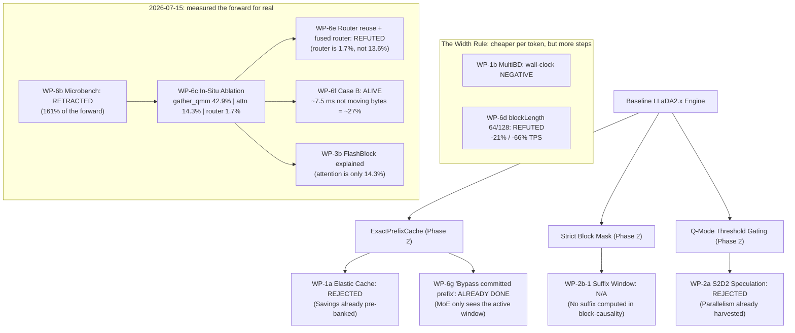

# NeoDiffusion Experiments Master List

This document serves as the master source of truth, indexing and summarizing all experimental optimization campaigns and work packages (WPs) executed across **Phase 2**, **Phase 3**, and **Phase 4** of the NeoDiffusion project.

---

## 1. Recommended Logging & Tracking Standard

To prevent losing track of future runs and preserve architectural history, we recommend adopting a unified **Three-Tier Documentation Standard**:

1. **The Master Index Table (This Document)**: A top-level lookup dashboard summarizing goals, key metrics, devices, verdicts, and paths.
2. **Individual Work Package Logbooks (`Plans/wp[N]-logbook.md`)**: Chronological developer logbooks containing raw CLI commands, pre-registered hypotheses, timeline progression, and troubleshooting.
3. **Structured Wiki Drafts (`Plans/wiki-drafts/wp-[N]-[name].md`)**: High-level, post-mortem summaries detailing what was built, findings, lessons learned, and diagrams for the final wiki.

### Standardized Telemetry Metadata for Future Runs
Every logged experiment row must record:
*   **Host Platform Details**: Device model, unified memory size, GPU core counts, memory bandwidth (e.g., *Mac Studio M2 Ultra, 192 GB RAM, 60 GPU Cores, 800 GB/s*).
*   **Environment Validity (`envValid`)**: Telemetry snapshot containing:
    *   `swapGrowth`: Swap growth during the run must be $\le 256$ MB.
    *   `freeMemoryStart`: Free memory at start must be $\ge 1/16$ of physical RAM (1.0 GB on M1 MBP; 12.0 GB on M2 Ultra Studio).
    *   `thermalState`: OS thermal state before/after must be `nominal` or `fair`.
*   **Engine Effective Echoes**: The actual runtime parameters parsed by the binary (`nBuf`, `tauAdd`, `speculationK`, etc.), rather than raw CLI string inputs, to prevent silent defaults from contaminating data.
*   **Warmup Status**: Identify and exclude the first run (`warmupIncluded: true` rows) from steady-state evaluations to ignore the ~19-second kernel compilation overhead.
*   **Prompt-Suite Domain**: Specify the suite evaluated (`chat`, `reasoning`, or `code`), as step latency and tokens-per-forward (TPF) are highly content-sensitive.
*   ⚠️ **Toolchain & Resolved MLX Version** (added 2026-07-15): the Swift toolchain **and** the `mlx-swift` version the binary actually linked (e.g. *Swift 6.0 / mlx-swift 0.31.4*). **`Package.resolved` is not evidence of this** — SwiftPM silently resolves down to the newest version the *local* toolchain can parse and rewrites the file in place. The two hosts have been running different MLX versions for the entire project (§3f). Without this field, a cross-host row cannot be interpreted.

---

## 1a. ⚠️ Cross-host step counts do not transfer — and it is NOT the MLX version (resolved 2026-07-16)

**Logical step counts diverge between the M1 and the Studio. The cause is the hardware, not `mlx-swift`.**

**The investigation (2026-07-15 → 07-16):**
*   `[Sourced]`: A real version split existed — **M1 MBP linked mlx-swift 0.31.6, Mac Studio linked 0.31.4**, for the whole project. Mechanism: 0.31.6 declares `swift-tools-version: 6.3`; the Studio's Xcode 16.0 (Swift 6.0) could not parse it, so SwiftPM silently resolved down to 0.31.4 and rewrote the tracked `Package.resolved`. Commit `d937058` (2026-07-14) committed one such downgrade. The split was found when WP-2b's deterministic chat dyn-τ (216→184 on M1) failed to reproduce on the Studio (215→219).
*   `[Sourced]`: **Hypothesis (MLX version is the cause) — TESTED and REJECTED.** The Studio was upgraded to Xcode 26.6 / Swift 6.3.3 and rebuilt on mlx-swift **0.31.6** (metallib via the Metal Toolchain component; see §4 debt). Re-running the dyn-τ×MultiBD factorial on 0.31.6 vs 0.31.4, **same host**: **0 of 143 cells** differ in `logicalSteps` or `tokensGenerated` — byte-identical. The only 0.31.6 effect is **wall-clock ≈+6%** (q-cached TPS, identical-method: chat 42.7→45.1, reasoning 73.8→78.0, code 102.6→109.0 = +5.6/+5.8/+6.3%; ms/forward −4.3%). So the MLX version does **not** move the trajectory.
*   `[Sourced]`: **Wall-clock refresh (2026-07-16, `scratch/refresh_*.jsonl`, 8 campaigns, all envValid, echoes verified).** Refreshed served baseline TPS on 0.31.6: **q-cached** chat 45.1 / reasoning 78.0 / code 109.0; **s-cached** 49.2 / 103.9 / 127.2. The ≈+6% is uniform, so **it rescales every recorded Studio TPS equally** — the *baseline* refresh changes no verdict.
*   `[Sourced]`: **Drift-free lever refresh (2026-07-16, `scratch/leverfresh_k4.jsonl` + `_k1.jsonl`, `lf-*` arms, same-process ≈0.33% CV, all envValid, all 128-tok outputs so TPS is step-driven and comparable).** This *does* re-adjudicate — and it dents two landed claims:
    *   **JOT (K=1, vs K=1 baseline): reasoning +28%** (97.4 vs 75.8 TPS; 25.5 vs 30 steps) — **confirms and strengthens** the +21.9% record. **Code −23%** (JOT alone hurts code — consistent with "reasoning preset only").
    *   **JOT+Credit code: the recorded +2.9% is a cross-K artefact — RESOLVED.** The jot-logbook baseline was *"the default q-cached 99.25 TPS"* = the **K=4 served default**, but JOT forces **K=1** → jot-credit(K1) 102.12 vs q-cached(K4) 99.25 = +2.9% compared apples-to-oranges. Drift-free K-matched: jot-credit(K1) **−17%** vs q-cached(K1) 129.3; even vs the K4 default on 0.31.6 it is **−1.8%** (106.9 vs 108.9) — the +2.9% does not survive. **Drop the jot-credit code preset. Bonus finding: q-cached@K1 code (129.3) beats @K4 (108.9) by +19%** — the K=4 speculation default is net-negative on code (WP-2a corroboration; worth a proper look).
    *   **Credit Decoding — the header params were WRONG; at the real shipped params it roughly reproduces.** git (7bb761f, introduction) shows `creditAlpha=creditGamma=0.5` **from day one — never 1.0**; the phase-4 doc lists α/γ=1.0 only as *grid-search candidates*. So the matrix header "α=1.0, γ=1.0" is a **documentation error** (fixed below) and `lf-credit-preset` (1.0/1.0, chat −11%) tested a config that was **never shipped**. At the **shipped** params (α=0.5/γ=0.5, `lf-credit-default`): chat **+1%** — reproduces the +1.8% within drift; the chat verdict holds, marginally. New: reasoning **−7%**, code **−3%** (never originally measured) — so credit is chat-marginal, **not** a global win; reconsider the *global* default-on.
    *   Combos (MultiBD-based, negative as expected): p3-combo chat −14% / reasoning −2% / code −22%; p4-combo chat −7% / reasoning −15% / code −36%. Adding credit to p3 helps chat (p4 +8% over p3 on chat, directionally matching the old "+14.4%") but worsens reasoning/code.
    *   **S2D2** stays from the flag run (`scratch/refresh_s2d2.jsonl`): chat 32.3 / reasoning 50.5 TPS — net-negative at default τ (not the τ=0.95 quality preset), as recorded.
*   `[Sourced]`: **Therefore the divergence is hardware.** Studio-0.31.6 (215→219 chat, 125→108 reasoning) still does **not** match M1-0.31.6 (216→184, 97→86) — same MLX, same 4-bit weights, same config, different GPU. Leading cause: floating-point non-determinism across Metal GPUs (different reduction orders at Γ threshold boundaries cascade into different trajectories). Suite-specific: chat baselines nearly match (216 vs 215), reasoning diverges hard (97 vs 125) — consistent with reasoning confidences sitting near thresholds. **Final confirmation pending**: the M1 run of current code on 0.31.6 (both hosts now on the same MLX). If M1 gives 216→184, hardware is confirmed; if 215→219, the old M1 record came from some other historical drift.

**Consequences:**
*   **No Studio data was ever invalidated.** All Studio rows are internally consistent (0.31.4, `host: Mac14,14`), and 0.31.6 reproduces them byte-for-byte on every deterministic metric. The 0.31.6 move only refreshes wall-clock (≈+6% uniform) — it rescales every TPS equally and changes **no relative verdict**.
*   **`logicalSteps` / `tpfLogical` are per-host deterministic, NOT hardware-independent.** The roadmap §0.1 protocol's phrase *"hardware-independent metrics decide; the Studio backfills recorded arms"* is wrong as written — a deterministic metric is only portable within one GPU. Cross-host, only *directional* transfer is safe (a lever that cuts steps on one host likely cuts them on the other, by a different amount). Re-word §0.1 accordingly.
*   **Toolchain is now matched** (both hosts Swift ≥6.3 / mlx-swift 0.31.6), so `Package.resolved` churn stops. Metallib note: `swift build` never compiles mlx-swift's `default.metallib`; only Xcode does, and 0.31.6 needs Xcode 26.x (§3f corollary).

---

## 2. Master Comparison Matrix

| Campaign / WP | Objective | Hardware Platform | Key Hyperparameters | Verdict | Key Algorithmic Metric | Wall-Clock Throughput (TPS) | Documentation Reference |
| :--- | :--- | :--- | :--- | :--- | :--- | :--- | :--- |
| **M6 Baseline** | Establish mini-model baseline; diagnose 50s/forward lag. | M1 MBP (16 GB) / M2 Ultra (192 GB) | $B=32$, $K_{\text{spec}}=4$, Q-mode / S-mode | **Complete** | Baseline established. | **M1**: 4.6–22.2 tok/s **M2 Ultra (0.31.4)**: 32.1–122.6 tok/s **M2 Ultra (0.31.6, 2026-07-16)**: q-cached 45.1/78.0/109.0, s-cached 49.2/103.9/127.2 (chat/reasoning/code) | [m6-logbook.md](file:///Users/andrebarlocher/Documents/Swift/NeoDiffusion/Plans/m6-logbook.md) |
| **M8 Quant Sweep** | Find optimal quantization layout for vocab. | M1 MBP (16 GB) | 4-bit g64, 4-bit g32, 6-bit experts | **Uniform 4-bit g64 default** | ~2.7% confident flip rate vs. BF16 CPU. | Footprint: ~9.57 GB | [m8-logbook.md](file:///Users/andrebarlocher/Documents/Swift/NeoDiffusion/Plans/m8-logbook.md) |
| **WP-1a Elastic-Cache** | Reuse active block KV cache across steps. | M1 MBP (16 GB) | $\gamma=0.98$ / static boundary $S \in [4, 16]$ | **REJECTED** | Steps/block: 12.6 $\rightarrow$ S4 13.4, S16 30.6. | Negative (drift test & indexing overhead) | [elastic-cache-logbook.md](file:///Users/andrebarlocher/Documents/Swift/NeoDiffusion/Plans/elastic-cache-logbook.md) |
| **WP-1b MultiBD** | Unmask up to two blocks in a single forward pass. | M1 MBP (16 GB) / M2 Ultra (192 GB) | $N_{\text{buf}}=2$, $\tau_{\text{add}}=0.5$, $\tau_{\text{semi}}=0.90$ | **Provisional ACCEPT** (serving preset, default-off) | TPF-logical: +23.3% (chat) / +29.5% (reasoning gen-256). | **M1**: compute-negative (~1.75x lag) **M2 Ultra**: 39.82 TPS (-17.4% vs. base) | [wp1b-logbook.md](file:///Users/andrebarlocher/Documents/Swift/NeoDiffusion/Plans/wp1b-logbook.md) |
| **WP-2a Auto-Speculation** | Self-speculation (S2D2) or draft graphs (Spiffy). | M1 MBP (16 GB) / M2 Ultra (192 GB) | S2D2, $\tau_{\text{span}}=8/16$, Spiffy D=3-8 | **ACCEPT (S2D2 preset, default-off)** | S2D2 yields 4.1–9.8 accepted tokens/step. | **M1**: compute-negative (~2x width) **M2 Ultra (S2D2)**: +14.6% chat / +19.8% reasoning | [wp2a-logbook.md](file:///Users/andrebarlocher/Documents/Swift/NeoDiffusion/Plans/wp2a-logbook.md) |
| **WP-2b Streaming-dLLM** | Suffix pruning (2b-1), dynamic threshold (2b-2), EOS exit (2b-3). | M1 MBP (16 GB) / M2 Ultra (192 GB) | $\alpha=0.6$, dynamic thresholding | **2b-2 ACCEPTED (preset, default-off)**; 2b-1 N/A; 2b-3 NULL | Steps/block: -14.8% (chat) / -11.3% (reasoning). | **M1**: compute-negative **M2 Ultra**: Net negative TPS due to MultiBD multiplier | [wp2b-logbook.md](file:///Users/andrebarlocher/Documents/Swift/NeoDiffusion/Plans/wp2b-logbook.md) |
| **WP-3a JOT Token Freezing** | Freeze expert/shared FFN compute for early-converged tokens. | M1 MBP (16 GB) / M2 Ultra (192 GB) | v2: stable K/V hold, `jotK=2`, `jotThreshold=0.9` | **ACCEPT (Reasoning preset)**; ❌ **DROP Code JOT+Credit (+2.9% was a cross-K artefact)** | v2 eliminates perturbation cascade; steps: +15% overhead. | **M1**: REJECT (CPU-GPU sync) **M2 Ultra (0.31.6 drift-free)**: reasoning **+28%** (confirms); JOT+Credit code **−17% vs K=1 base** — old +2.9% compared K=1 vs the K=4 default (§1a) | [jot-logbook.md](file:///Users/andrebarlocher/Documents/Swift/NeoDiffusion/Plans/jot-logbook.md) |
| **WP-3b FlashBlock Caching** | Low-level MSL metal kernel attention caching. | M1 MBP (16 GB) | Custom MSL page-table kernels | **REJECTED (M1)** — ⚠️ **verdict INVALID, re-bench needed** | Parity holds under $\tau=0$ — *which is exactly why the bug hid*. **Its `.reuseCache` path never once ran** (2026-07-15). | Sync overhead: Vanilla 8.55 TPS vs. FlashBlock 5.13 TPS | [wp-3b draft](file:///Users/andrebarlocher/Documents/Swift/NeoDiffusion/Plans/wiki-drafts/wp-3b-flashblock-attention-caching.md) · [gather_qmm §9](file:///Users/andrebarlocher/Documents/Swift/NeoDiffusion/Plans/gather_qmm_handoff.md) |
| **WP-4a TSCV** | Vote on stable tail predictions to resolve noise. | M1 MBP (16 GB) / M2 Ultra (192 GB) | $\alpha=1.0$, $t_{\text{start}}=0.9$, 100 GSM8K test prompts | **ACCEPT (Landed Default-On)** | GSM8K accuracy: **M1**: 16% $\rightarrow$ 24% (+8pp) **M2 Ultra**: 15% $\rightarrow$ 21% (+6pp) | Zero overhead CPU voting (<1ms) | [wp4a-logbook.md](file:///Users/andrebarlocher/Documents/Swift/NeoDiffusion/Plans/wp4a-logbook.md) |
| **WP-4b ICE Prompting** | Structured in-place templates for concurrent thinking. | M1 MBP (16 GB) / M2 Ultra (192 GB) | Dynamic $B = \text{prompt} + \text{gen}$, $\tau_{\text{ans}}=0.9$, $N_t=4$ | **ACCEPT (Served Preset)** — ⚠️ **+4pp is not statistically significant** | GSM8K (M2 Ultra): 15% $\rightarrow$ 19% (+4pp), but paired **McNemar p=0.481** (gained 11 / lost 7); no arm in the 7-arm sweep reaches significance, and the grid is non-monotonic ($N_t$ 2/3/4 $\rightarrow$ 7%/15%/19%). | Promoted for reasoning-heavy presets; higher step count (71.7 vs. 38.3) | [wp4b-logbook.md](file:///Users/andrebarlocher/Documents/Swift/NeoDiffusion/Plans/wp4b-logbook.md) |
| **WP-4d Credit Decoding** | Boost top predictions via credit feedback matrix. | M1 MBP (16 GB) / M2 Ultra (192 GB) | **shipped: $\beta=0.9$, $\gamma=0.5$, $\alpha=0.5$** (Γ-only; git 7bb761f — *the old "γ=1.0, α=1.0" was a doc error, only a grid candidate*) | **ACCEPT (Default-On) — chat-marginal only** | Momentum filter. Same comparison moved **+6.2% → +1.8%** (sign flip). No blind quality gate. **2026-07-16 drift-free (§1a): at shipped params reproduces chat +1%** (≈+1.8%); reasoning −7% / code −3% (never originally measured). | **M2 Ultra (chat)**: +1% (drift-free, ≈ recorded +1.8%); **not a global win** — reconsider *global* default-on | [wp-4d-credit-decoding.md](file:///Users/andrebarlocher/Documents/Swift/NeoDiffusion/Plans/wiki-drafts/wp-4d-credit-decoding.md) |
| **WP-6a MoE Adaptive Dispatch** | Dynamic index sorting branch based on sequence length $T$. | Mac Studio M2 Ultra | Mini crossover $T=192$, Flash crossover $T=128$ | **ACCEPT (Landed Default-On)**, but **dormant** | Prefill GPU sorting speedup: up to $14.32\times$ at $T=2048$. | Prevents sorting serialization overhead during decode ($T \le 128$) | [wp-6a-moe-adaptive-dispatch.md](file:///Users/andrebarlocher/Documents/Swift/NeoDiffusion/Plans/wiki-drafts/wp-6a-moe-adaptive-dispatch.md) |
| **WP-6b Module Attribution** | Per-module latencies on Studio via `testModuleAttribution`. | Mac Studio M2 Ultra | 6 warm repetitions | **RETRACTED** | $19 \times 2.33 = 44.3$ ms = **161% of the 27.5 ms forward** — impossible. | n/a — timings unusable as a budget | [wp-6b draft](file:///Users/andrebarlocher/Documents/Swift/NeoDiffusion/Plans/wiki-drafts/wp-6b-m2-ultra-module-attribution.md) · [gather_qmm §5.3](file:///Users/andrebarlocher/Documents/Swift/NeoDiffusion/Plans/gather_qmm_handoff.md) |
| **WP-6c In-Situ Attribution** | Replace the broken microbench: causal ablation inside a real forward. | Mac Studio M2 Ultra | `attr-*` arms; 4 rounds, 288+180+108+72 rows | **Method ESTABLISHED; budget measured** | `gather_qmm` **42.9%**, routed-MoE 56.3% (replicated 56.2/56.3), attention 14.3%, router **1.7%**, lm_head ~3%. | Control reproduces served baseline to **+0.1–1.4%** | [gather_qmm §5.6–§7](file:///Users/andrebarlocher/Documents/Swift/NeoDiffusion/Plans/gather_qmm_handoff.md) |
| **WP-6d blockLength Sweep** | Amortise expert bytes over more tokens per forward. | Mac Studio M2 Ultra | $B \in \{32, 64, 128\}$ as per-arm overrides | **REFUTED** | steps/block $7.78 \rightarrow 13.36$ (**1.72×**) vs a **1.18×** break-even. | $B{=}64$: **−21.3%**; $B{=}128$: **−66.1%** | [gather_qmm §7.1](file:///Users/andrebarlocher/Documents/Swift/NeoDiffusion/Plans/gather_qmm_handoff.md) |
| **WP-6e Router Reuse** | Reuse routing across steps (80% expert-set overlap measured). | Mac Studio M2 Ultra | `routerReuseSteps` $\in \{2, 4, 999\}$ | **REFUTED** — and killed the fused-router idea | steps/block **1.35×** at $N{=}2$. `reuse-999` sizes the router's true marginal cost at **0.48 ms = 1.7%** (ablation said 13.2% — **7.7× overstated**). | $N{=}2$: **−14.3%**; $N{=}4$: **−24.1%** | [gather_qmm §11](file:///Users/andrebarlocher/Documents/Swift/NeoDiffusion/Plans/gather_qmm_handoff.md) |
| **WP-6f Case B Probes** | Is `gather_qmm` bandwidth-bound? Is dequant the bottleneck? | Mac Studio M2 Ultra | `.moeFixedExperts` probe; `--dequantize-experts` (FP16, 31.5 GB) | **CASE B ALIVE — the only surviving lever** | 7× fewer bytes ⇒ **25% SLOWER** (not bandwidth-bound). FP16 (4× bytes, no dequant) is **1.50× slower** ⇒ quantization vindicated. **~7.5 ms (~27%) of the 4-bit gather is not moving bytes.** | 4-bit 11.92 ms @162 GB/s vs FP16 17.86 ms @433 GB/s | [gather_qmm §10, §12](file:///Users/andrebarlocher/Documents/Swift/NeoDiffusion/Plans/gather_qmm_handoff.md) |
| **WP-6g Routing Distribution** | Measure the distinct-expert count the roofline hinges on. | Mac Studio M2 Ultra | `--dump-routing`, 246 forwards, `speculationK=1` | **Complete — overturned two models** | **57.3** distinct experts/layer (models predicted 162 / 111). Phase-dependent: **49.6** (high noise) → **64.2** (low). Step-to-step Jaccard **80%**. | n/a (per-layer readbacks; timings invalid by construction) | [gather_qmm §8](file:///Users/andrebarlocher/Documents/Swift/NeoDiffusion/Plans/gather_qmm_handoff.md) |

---

## 3. Detailed Experiment Summaries & Technical Verdicts

### M6 Baseline Campaign
*   **Objective**: Diagnose the massive ~50s/forward lag observed during early runs on the M1 MBP dev host, and establish the steady-state baseline performance.
*   **Host Environment**: MacBook Pro M1 (16 GB RAM), Mac Studio M2 Ultra (192 GB RAM).
*   **Key Results**:
    *   `[Sourced]`: The 50s/forward anomaly was caused by macOS paging under memory pressure. An unloaded M1 MBP achieves a steady-state forward pass of **~0.34s** (~63% spent in MoE blocks, ~10% in the LM head).
    *   `[Sourced]`: Kernel graph compilation incurs a **~19s** per-process warmup concentrated in the first block.
    *   `[Sourced]`: `gatherQuantizedMM` is the fastest MoE dispatch variant on the M1, running in **4.5 ms/op** at `[256 × 512 × 2048]` (beating dense-all-experts at 11.7 ms and dequant+gather at 26.4 ms).
    *   `[Sourced]`: Re-refereeing baseline rates on the Mac Studio M2 Ultra yields serving speeds of **32.1–122.6 TPS**, eliminating thermal/paging bottlenecks.
*   **Verdict**: **Complete**. Baseline established; telemetry validity checking (`envValid` snapshot) automated.

### M8 Quantization Sweep
*   **Objective**: Sweep axes (group size, expert bit-depth, LM head quantization) to minimize vocabulary projection noise while keeping the model memory-footprint within M1 limits.
*   **Host Environment**: MacBook Pro M1 (16 GB RAM).
*   **Key Results**:
    *   `[Sourced]`: The uniform 4-bit g64 layout default exhibits a **~2.7% confident flip rate** (reference margin $\ge 0.20$ flipping tokens) vs. a streamed BF16 CPU reference.
    *   `[Sourced]`: Flips are concentrated in step-0 fully-masked canvas locations (5.2% flips), where $\Gamma$-selection is initialized.
    *   `[Sourced]`: Quantizing `lm_head` to 4-bit causes a flip margin of 0.32, which exceeds the noise limit (0.23), leading to a **REJECT** (the LM head stays 16-bit).
    *   `[Sourced]`: Upgrading expert grouping to group-32 (g32) or bit-depth to 6-bit experts did not improve the flip rate (3.4% and 3.1% flips, respectively), despite adding memory footprint.
*   **Verdict**: **Uniform 4-bit g64 defaults accepted** as optimal quality-footprint knee.

### WP-1a: Elastic-Cache Pipeline
*   **Objective**: Implement sliding window $\beta$ and depth boundary $\ell^\star$ KV-cache staleness reuse inside active blocks.
*   **Host Environment**: MacBook Pro M1 (16 GB RAM).
*   **Key Results**:
    *   `[Sourced]`: Active-KV reuse increased generation steps monotonically (S4: 13.4, S16: 30.6 vs. 12.6 baseline).
    *   `[Sourced]`: Confidence starvation occurred at reuse depth $S \ge 12$, stalling block updates.
    *   `[Inferred]`: Exact block-causal semantics and `ExactPrefixCache` already pre-banked the paper's caching gains. Fused QKV projections limit the FLOP savings ceiling to ~4%, which was wiped out by similarity-testing overhead.
*   **Verdict**: **REJECTED (Negative Result)**.

### WP-1b: Training-free MultiBD
*   **Objective**: Support concurrently unmasking up to two blocks in a single 64-token forward pass via $\tau_{\text{add}}$ activation and $\tau_{\text{semi}}$ fallbacks.
*   **Host Environment**: MacBook Pro M1 (16 GB RAM) / Mac Studio M2 Ultra (192 GB RAM).
*   **Key Results**:
    *   `[Sourced]`: TPF-logical improved by **+23.3%** on chat ($\tau_{\text{add}}=0.5$) and **+22.3%** on reasoning ($\tau_{\text{add}}=0.1–0.3$). Reasoning's gain scales with sequence runway (reaching **+29.5%** at gen-256).
    *   `[Sourced]`: On M1, a ~1.75x dual-phase step-latency multiplier rendered the wall-clock speedup negative.
    *   `[Sourced]`: On the M2 Ultra, wide active-window forward evaluations increase step latency, leading to a negative wall-clock TPS (-17.4% on chat, -12.3% on reasoning).
    *   `[Sourced]`: Composing MultiBD + Dynamic-$\tau$ with Credit Decoding (`p4-combo`) recovers chat serving performance to **45.55 TPS** (-5.5% behind baseline, a **+14.4% speedup** over `p3-combo`).
*   **Verdict**: **Provisional ACCEPT** (disabled by default; accepted as a custom served preset option for long-form generations).

### WP-2a: Auto-Speculation (S2D2 / Spiffy)
*   **Objective**: Implement single-model speculative decoding using self-speculation (S2D2) or offline calibrated draft graphs (Spiffy).
*   **Host Environment**: MacBook Pro M1 (16 GB RAM) / Mac Studio M2 Ultra (192 GB RAM).
*   **Key Results**:
    *   `[Sourced]`: S2D2 achieves high logical acceptance (9.77 code, 6.78 reasoning, 4.12 chat tokens/step).
    *   `[Sourced]`: On M1, verification requires $3B$ forward width ($1B$ target + $2B$ verifier), doubling compute widths and rendering the width-corrected TPF negative (0.52–0.84 vs. 1.3–1.5 baseline).
    *   `[Sourced]`: On the M2 Ultra, S2D2 (at $\tau=0.95$) achieves wall-clock speedups: Chat: 33.62 TPS (+14.6%), Reasoning: 59.40 TPS (+19.8%).
    *   `[Sourced]`: Spiffy offline calibration traces indicate a draft graph ceiling of **27–35% forward count savings** (D=3-8).
*   **Verdict**: **ACCEPT (S2D2 serving preset, default-off)**.

### WP-2b: Streaming-dLLM Cluster
*   **Objective**: Implement suffix-window pruning (2b-1), dynamic threshold (2b-2), and EOS early exit (2b-3).
*   **Host Environment**: MacBook Pro M1 (16 GB) / Mac Studio M2 Ultra (192 GB).
*   **Key Results**:
    *   `[Sourced]`: 2b-1 is closed **N/A** (block-causal LLaDA2.x never forwards suffix blocks).
    *   `[Sourced]`: 2b-2 (Dynamic Thresholding $\alpha=0.6$) reduced logical steps by **-14.8%** (chat) and **-11.3%** (reasoning). Composed with MultiBD ($N_{\text{buf}}=2$), it yielded a cumulative **-25% chat / -28% reasoning steps**.
    *   `[Sourced]`: 2b-3 is a **mechanistic NULL** (post-EOS padding naturally clears static thresholds early, making early-exit logic redundant).
*   **Verdict**: **2b-2 ACCEPTED as serving preset (in `p3-combo`, default-off)**; 2b-1 N/A; 2b-3 NULL.

### WP-3a: JOT Token-Level Early Stopping
*   **Objective**: Freeze expert/shared FFN computations for tokens that have early-converged.
*   **Host Environment**: MacBook Pro M1 (16 GB) / Mac Studio M2 Ultra (192 GB).
*   **Key Results**:
    *   `[Sourced]`: v1 (FFN zeroing only) perturbed active token hidden states, causing representation cascades that doubled steps (+75% to +99%).
    *   `[Sourced]`: v2 (faithful K/V hold) pins frozen token's K/V post-qk-norm/post-RoPE, eliminating cascades (step overhead dropped to +15%).
    *   `[Sourced]`: On M1, dynamic index gathering requires a per-layer CPU-GPU sync (`numActive.item()`), stalling wall-clock performance.
    *   `[Sourced]`: On the M2 Ultra, JOT achieves a **+21.9% wall-clock speedup** on reasoning tasks (92.99 vs. 76.31 TPS). — ⚠️ **AMENDED 2026-07-17 (final-plan §2, F-j/F-k/F-l; interleaved single-process re-measure): this figure is REAL vs the K=4 default but MISATTRIBUTED.** JOT-faithful forces K=1, and K=1 *by itself* is +16.2% on reasoning (byte-identical output — speculation is output-invariant). Decomposition: +21.9% ≈ K=1 switch (×1.162) × JOT-on-K=1 (×1.055). **JOT's own contribution is +5.5% reasoning-only** (chat −26%, code −20%); the record's baseline (76.3) was cold — the drift-free interleaved baseline is 92–93. Actionable: take the +16% for free via K=1 (F-l), skip JOT elsewhere.
    *   `[Sourced]`: Composing JOT + Credit Decoding (`jot-credit`) achieves **102.12 TPS on code** (+2.9% net speedup over baseline).
*   **Verdict**: **ACCEPT (Reasoning served preset; JOT+Credit code served preset)**.

### WP-3b: FlashBlock Attention Caching
*   **Objective**: Bypass full cache attention passes when the number of modified tokens is low using dynamic low-level Metal shaders.
*   **Host Environment**: MacBook Pro M1 (16 GB RAM).
*   **Key Results**:
    *   `[Sourced]`: Functional parity is verified under $\tau=0$.
    *   `[Sourced]`: Launching custom MSL shaders from Swift loops requires CPU-GPU stream synchronization, resulting in a wall-clock slowdown on M1 (Vanilla: 8.55 TPS vs. FlashBlock: 5.13 TPS).
    *   ⚠️ `[Sourced, 2026-07-15]`: **FlashBlock never once took its `.reuseCache` path.** `stepIndex += 1` sat inside the Elastic-Cache branch, which the FlashBlock/JOT branch `return`s before reaching — so with Elastic off (**every configuration ever benched**) `stepIndex` stayed 0, `isFirstStepOfBlock` was permanently `true`, and `chooseStepKind` opens with `if isFirstStepOfBlock { return .refreshCache }`. It paid full setup on every step and took none of the benefit its design exists for.
    *   `[Inferred]`: **The parity test could not catch this** — it verified at $\tau=0$, where refresh-every-step *is* the expected behaviour. The one configuration that would have exposed the bug is the one the test did not run.
    *   Fixed 2026-07-15 (`stepIndex` now increments once per forward on every path; Elastic's semantics preserved; full suite 118 tests green). See [gather_qmm §9](file:///Users/andrebarlocher/Documents/Swift/NeoDiffusion/Plans/gather_qmm_handoff.md).
    *   ⚠️ `[Sourced, 2026-07-15]`: **Re-bench attempted and BLOCKED — FlashBlock does not converge.** `chat-capital` 34.39 → **5.13 TPS (−85%)**, steps/block 9.00 → **28.50 (3.2×)**; the second prompt hung (killed after 23 min). **It is a GPU-level stall inside a single step, not a convergence failure**: the loop's 1000-step guard (`DiffusionEngine+Scheduler.swift:194`) never fired and no row was written, which merely-slow looping could not produce. Leading hypothesis: an out-of-bounds tile read (the target of André's WIP `safe_j` clamp — which was already in the tree for this run and did not prevent it).
    *   ⚠️ `[Confound — cause NOT established]`: that run was built from a tree carrying **uncommitted WIP edits to `FlashBlockRunner.swift`** (a bounds clamp on the tile loads) and `LLaDA2Attention.swift`. Candidate causes: (1) the `stepIndex` fix letting `.reuseCache` run for the first time on broken code, (2) the WIP kernel edits, (3) their interaction. **Disambiguate by re-running at `HEAD` with the WIP stashed.** The clamp itself hints an out-of-bounds tile read existed — a plausible independent cause.
*   **Verdict**: **REJECTED (M1)** — ⚠️ **verdict INVALID *and* the mechanism has never worked.** The old number measured FlashBlock-as-vanilla-plus-overhead (reuse disabled by the bug). **Next step is debugging `FlashBlockRunner`'s `.reuseCache` path, not re-benching** — and note WP-6c caps the prize at attention's **14.3%** regardless, so weigh whether it is worth the effort at all.

### WP-4a: Temporal Self-Consistency Voting (TSCV)
*   **Objective**: Recover answers generated during intermediate denoising steps but subsequently overwritten by final-step decoding noise.
*   **Host Environment**: MacBook Pro M1 (16 GB) / Mac Studio M2 Ultra (192 GB).
*   **Key Results**:
    *   `[Sourced]`: Grid searches show optimal parameters at $\alpha=1.0$ (gentle decay) and $t_{\text{start}}=0.9$ (late stable cutoff).
    *   `[Sourced]`: TSCV recovers correctness on GSM8K-100, lifting accuracy from 16.00% to **24.00%** on M1 (+8pp, +50% relative gain) and from 15.00% to **21.00%** on M2 Ultra (+6pp).
    *   `[Sourced]`: Vote evaluation runs on the CPU post-hoc, taking <1ms and adding zero compute cost.
*   **Verdict**: **ACCEPT (Landed Default-On)**.

### WP-4b: In-Place Chain-of-Thought Prompting (ICE)
*   **Objective**: Embed structured reasoning step templates directly into the masked token canvas to enable concurrent thinking.
*   **Host Environment**: MacBook Pro M1 (16 GB) / Mac Studio M2 Ultra (192 GB).
*   **Key Results**:
    *   `[Sourced]`: The model successfully generated correct step-by-step reasoning on math checks using 57 steps total (2 post-steps).
    *   `[Sourced]`: Infinite-loop hangs in Phase 1 were resolved by monitoring `thinkingMasksLeft == 0` to trigger early exits.
    *   `[Sourced]`: On the M2 Ultra backfill, ICE-PP ($\tau=0.9$, $N_t=4$) increased GSM8K-100 accuracy from 15.00% to **19.00%** (+4pp net gain).
*   **Verdict**: **ACCEPT (Served Preset)** for reasoning-heavy workloads.

### WP-4d: Credit Decoding
*   **Objective**: Accumulate raw prediction consensus over time to boost logits at high-consensus positions, accelerating unmasking.
*   **Host Environment**: MacBook Pro M1 (16 GB) / Mac Studio M2 Ultra (192 GB).
*   **Key Results**:
    *   `[Sourced]`: Scoping the logit boost exclusively to the $\Gamma$ (unmasking) pathway keeps edits, freezes, and diagnostics on raw predictions.
    *   `[Sourced]`: On the M2 Ultra, Credit Decoding achieves a **+1.8% speedup** on chat (49.04 TPS vs. 48.19 TPS baseline).
    *   `[Sourced]`: Credit Decoding acts as a crucial latency mitigation layer when composed with MultiBD (`p4-combo`: +14.4% TPS over `p3-combo`) or JOT (`jot-credit`: +9.8% TPS over JOT alone).
*   **Verdict**: **ACCEPT (Landed Default-On)**.

### WP-6a: MoE Adaptive GPU Sorting & T-Aware Dispatch
*   **Objective**: Address SIMD divergence in Mixture of Experts routing without regressing decode latency ($T < 128$).
*   **Host Environment**: Mac Studio M2 Ultra (192 GB).
*   **Key Results**:
    *   `[Sourced]`: Bypassing index sorting at decode-time ($T < 128$) avoids serial sorting latency overhead (~0.43 ms).
    *   `[Sourced]`: Applying GPU-based sorting at prefill-time ($T \ge 128$) yields memory coalescing speedups (up to **14.32x** at $T=2048$ on the quantized path).
    *   `[Sourced]`: Crossover occurs at $T=128$ for Flash shapes ($H=4096$) and $T=192$ for Mini shapes ($H=2048$).
*   **Verdict**: **ACCEPT (Landed Default-On)**.

### WP-6b: Microbench Module Attribution — **RETRACTED**
*   **Objective**: Port `LLaDAMoEDispatchBench.testModuleAttribution` to the Studio to size each module.
*   **Host Environment**: Mac Studio M2 Ultra (192 GB, 60-core GPU).
*   **Key Results**:
    *   `[Sourced]`: Measurements are real and tightly repeatable (MoE block 2.33 ms, σ across 6 runs ≈ 0.07 ms).
    *   `[Sourced]`: **They cannot be a budget.** $19 \times 2.33 = 44.3$ ms = **161% of the measured 27.5 ms forward**, before counting attention, lm_head or norms. An attribution exceeding 100% of the thing it attributes is measuring something else.
    *   `[Inferred]`: Cause is the harness — `for _ in 0..<reps { eval(body()) }` pays a graph-eval/sync per rep that production never pays. **The distortion is host-dependent**: on the M1 the same harness reconciles (19 × 11.3 = 215 ms of a 340 ms forward = 63%, matching WP-6c's in-situ 60.6% — see M6), because the fixed sync cost is negligible against slow compute. Against the Studio's ~5–10× faster compute it dominates.
*   **Verdict**: **RETRACTED**. Its §3 "hardware speedups" divide two differently-contaminated numbers (real M1→Studio forward speedup is **12.4×**, not 6.20×); §4B/§4C attribute the harness's own sync to production. **M1-era figures from this harness are corroborated; Studio-era ones are ordinal at best.**

### WP-6c: In-Situ Forward Attribution (Causal Ablation)
*   **Objective**: Replace the retracted microbench with a method that cannot fail the same way — time a *whole forward* with and without a module, so any fixed harness cost is common-mode and cancels.
*   **Host Environment**: Mac Studio M2 Ultra. All arms in **one process** (`envValid`, thermal nominal, 93 GB free).
*   **Key Results**:
    *   `[Sourced]`: **Control passes** — `attr-full` reproduces the served `q-cached` baseline to **+0.1–1.4%** across four independent rounds, in different processes on different days.
    *   `[Sourced]`: **Sanity gate passes** — terms all positive, summing to exactly 100% (the gate WP-6b failed at 161%).
    *   `[Sourced]`: Budget: `gather_qmm` **42.9%**, router **1.7%** (§WP-6e), shared expert 4.2%, attention **14.3%** (incl. KV growth), lm_head ~3%, remainder (norms + sampler + loop) ~21%.
    *   `[Sourced]`: routed-MoE replicated at **56.2%** then **56.3%** across independent runs — 0.1pp apart.
    *   `[Sourced]`: **Explains WP-3b retroactively**: FlashBlock optimises attention, which is only **14.3%** of the forward. Even flawless reuse cannot exceed that.
*   **Verdict**: **Method established**; the budget is the project's first trustworthy forward decomposition. **Caveat: the deltas are marginals, not a partition** — see §4.3.

### WP-6d: blockLength Sweep — **REFUTED**
*   **Objective**: Bigger blocks amortise expert weights over more tokens (bytes/token fall ~32% at $B{=}64$).
*   **Host Environment**: Mac Studio M2 Ultra; `bl-32/64/128` as per-arm overrides in one process (`bl-32` reproduces the control).
*   **Key Results**:
    *   `[Sourced]`: The amortisation is **real** — ms/forward grows only **1.63×** for 2× the tokens (sublinear, as the byte model predicted).
    *   `[Sourced]`: And **insufficient** — steps/block grows **1.72×** ($7.78 \rightarrow 13.36$) against a **1.18×** break-even. Net **−21.3% TPS** at $B{=}64$, **−66.1%** at $B{=}128$.
*   **Verdict**: **REFUTED**. Same mechanism that sank WP-1b MultiBD: *a wider forward is cheaper per token, but a wider block needs proportionally more steps, and steps are forwards.* **No quality sweep was needed — the speed case never survives, so there is nothing for quality to rescue.**

### WP-6e: Router Reuse — **REFUTED** (and it killed the fused-router proposal)
*   **Objective**: WP-6g measured 80% expert-set overlap between consecutive steps — so does the router need to run every step?
*   **Host Environment**: Mac Studio M2 Ultra.
*   **Key Results**:
    *   `[Sourced]`: Stale routing costs **35% more steps** at $N{=}2$. Net **−14.3% TPS** ($N{=}2$), **−24.1%** ($N{=}4$). **80% set-overlap did not mean routing is reusable** — the ~20% that churns is the part that matters.
    *   `[Sourced]`: **`reuse-999` sizes the router's true in-context marginal cost at 0.48 ms = 1.7%** — where the ablation split said 13.2%. **Overstated 7.7×.**
    *   `[Inferred]`: The router's cost is largely **CPU-side dispatch that overlaps with GPU execution**. With 11.9 ms of GEMM queued, the CPU builds its ~342 tiny kernels while the GPU is busy — free. Remove the GEMMs and nothing is left to hide behind, which is exactly the arm the split measured them in.
*   **Verdict**: **REFUTED**. **Consequently the fused-router megakernel (ceiling 1.7%, not 13.6%) and the `argPartition` top-k idea (a subset of that 1.7%) are both dead**, as is the "39% of the forward is dispatch-bound" reframing.

### WP-6f: Case B Probes — **the only surviving lever**
*   **Objective**: Settle whether `gather_qmm` is memory-bound, and whether dequantization is what caps it.
*   **Host Environment**: Mac Studio M2 Ultra.
*   **Key Results**:
    *   `[Sourced]` **Coalescing probe** (`.moeFixedExperts`: identical picks/FLOPs, 7× fewer bytes): **25% SLOWER** (14.76 vs 11.78 ms). Time does **not** track bytes — no bandwidth-bound kernel behaves this way.
    *   `[Sourced]` `gather_qmm` sits at **20% of bandwidth peak, 12% of compute peak, 207 µs/call** — bound by none of bandwidth, compute or dispatch.
    *   `[Sourced]` **FP16 probe** (`--dequantize-experts`, 31.5 GB, `gatherMM` replaces `gatherQuantizedMM`): **4-bit is 1.50× FASTER than FP16** despite FP16 having zero dequant work. **Quantization is vindicated by direct measurement** — dropping it is not an escape.
    *   `[Inferred]` But the same gather family moves bytes at **433 GB/s** (FP16) vs **162 GB/s** (4-bit) — 2.7×. Decomposed: 4-bit at FP16's demonstrated rate would take 4.46 ms; it takes 11.92 ms ⇒ **~7.5 ms (~27% of the forward) is not moving bytes**. Model closes on both arms.
*   **Verdict**: **CASE B ALIVE — the only lever still standing.** Its *escape* (drop quantization) is refuted; its *premise* (large non-bandwidth cost in the 4-bit inner loop) is supported and sized at **~27% upper bound**. **Caveat (inferred)**: assumes `gatherQuantizedMM` *could* reach `gatherMM`'s 433 GB/s — different kernels, so 7.5 ms is a ceiling, not a promise.

### WP-6g: Routing Distribution
*   **Objective**: Measure the distinct-expert count every roofline in this project hinges on.
*   **Host Environment**: Mac Studio M2 Ultra; `--dump-routing`, 246 forwards, `speculationK=1`. **Per-layer readbacks ⇒ timings from this run are invalid by construction; only the distribution is used.**
*   **Key Results**:
    *   `[Sourced]`: **57.3 distinct experts/layer/forward** (median 55, range 8–144) — where the uniform model predicted **162** and the concentrated model **111**. **Both wrong, same direction.** 256 picks land on ~57 experts ⇒ **~4.5 picks per expert**; expert popularity is heavily skewed.
    *   `[Sourced]`: **Noise-aware routing is REAL** and in the predicted direction: **49.6** distinct experts at high noise (mask > 0.6) → **61.3** mid → **64.2** at low noise. Consecutive steps share **80%** of their expert set (Jaccard).
    *   `[Sourced]`: The "bypass MoE for the committed prefix" idea is **already implemented** — `ExactPrefixCache` means the MoE only ever sees the active window (**sixth** instance of the Redundancy Rule).
*   **Verdict**: **Complete.** Overturned the roofline input and directly enabled WP-6f's verdict. As an *optimisation* it is weak (the working set is ~1.9 GB/forward regardless of phase); as a *measurement* it was decisive.

---

## 4. Key Architectural Insights & Global Lessons

### 1. The Redundancy Rule (Baseline Relativity)
Optimizations proposing large gains in standalone papers often collapse when integrated into a highly optimized engine:
*   `ExactPrefixCache` made active-KV cache reuse (`Elastic-Cache`) redundant.
*   Block-causal attention made suffix window pruning (`Streaming-dLLM`) N/A.
*   Aggressive parallel threshold decoding (`Q-mode`) already harvests the token parallelism that self-speculation (`S2D2`) target, making speculation compute-negative on typical hosts.
*   Post-EOS padding already clears the static threshold early, making EOS early-exit (`2b-3`) a mechanistic null.
*   `ExactPrefixCache` also pre-banks noise-aware routing's "bypass MoE on the committed prefix" — the MoE never sees a committed token (WP-6g). **Sixth instance.**

**The rule now has six confirmations and zero counter-examples. Treat any proposal's headline number as an upper bound that the baseline has probably already collected, and look for where it was banked *before* implementing.**

### 2. Apple Silicon Hardware Constraints
On unified-memory Apple Silicon:
*   At low batch sizes, steps are highly compute-bound. Algorithmic steps/block gains (such as MultiBD or JOT) only convert to wall-clock throughput speedups if the step-latency multiplier is low, making GPU-wide execution (like the Studio M2 Ultra) the ultimate validator.
*   Explicit device-stream synchronization barriers (`Stream.gpu.synchronize()`, `cb.waitUntilCompleted()`) between CPU and GPU introduce severe latency taxes that override core execution speedups. Removing sync boundaries (as done in JOT Option A and GPU Sorting) is essential to preserve wall-clock wins.
*   **The Width Rule** (WP-1b, WP-6d — two independent confirmations): *widening a forward is cheaper per token but needs proportionally more steps, and steps are forwards.* MultiBD and blockLength both bought sublinear per-forward cost and both lost on wall-clock, for the same reason. Any future "more tokens per forward" proposal must clear its steps/block break-even **before** anything else is measured.

### 3. Measurement Method — hard-won, three retractions deep

**3a. A microbench that wraps each op in its own `eval()` does not measure production.** It pays a graph-eval/sync per rep that a real forward never pays. **The distortion is host-dependent** and therefore invisible until it isn't: the same harness reconciles on the M1 (63% MoE, matching in-situ 60.6%) and produces **161% of the forward** on the Studio, whose compute is 5–10× faster. **Never size a module from an isolated op timing on a fast host.** (WP-6b)

**3b. Ablation deltas are marginals, not a partition.** A delta answers *"what does removing X from **this** configuration cost"* — not *"what is X worth."* Deltas measured against **different baselines are not interchangeable**, and on a GPU the difference is not academic: **work that hides behind other work is free until the work it hides behind goes away.** The router's cost read 13.2% when measured in a GEMM-less arm and **1.7%** when measured against a full forward — a **7.7× error** that killed a two-day recommendation. **Rule: difference every arm against the FULL forward, never against another ablation.** (WP-6e)

**3c. Two arithmetic identities have caught more real bugs than any test.** Both are cheap; run them on every attribution:
*   **Sanity gate** — every term positive, sum ≤ 100%. Caught WP-6b's 161%, and caught an `.lmHead` ablation reporting **86%** of the forward (its constant substitute had let MLX dead-code-eliminate the *entire transformer*).
*   **Control arm** — an unablated arm must reproduce the served baseline. Catches mis-links, stale builds, and wrong-overload wiring.

**3d. Timing cannot distinguish "this module is free" from "this module was deleted."** Any ablation that keeps a module running without its normal consumer is one DCE away from measuring nothing. Assert it **behaviourally** (output must change), never by reasoning about the optimiser. A wrong-overload wiring bug and a lazy-eval elision were both caught this way — each would have produced a clean, confident, entirely fake null.

**3e. Per-arm parameters, one process.** Until 2026-07-15 every bench lever was a process-global CLI flag, so every A/B was cross-process — where drift is **±6–10%** against a within-process CV of ~0.33%. That is why sub-10% effects (WP-4d's +1.8%) were never resolvable: the same comparison moved ~4pp between two clean runs, including a sign flip. `LLaDAArm.overrides` fixes this generally. **Known residual**: the bench loops arm-major, so arm identity still correlates with elapsed time; run-major interleaving is needed before trusting anything near the noise floor.

**3f. The linked dependency version is part of the environment, and `Package.resolved` does not record it faithfully — but it was a red herring for the step-count divergence.** (2026-07-15/16, §1a) SwiftPM silently resolves *down* to the newest version the **local toolchain** can parse and rewrites the tracked lock file in place, so two hosts on the same commit linked **different `mlx-swift`** (M1 0.31.6 / Studio 0.31.4) undetected. This looked like the cause of a deterministic metric (logical steps) failing to transfer M1→Studio — but **matching the versions disproved it**: Studio 0.31.6 ≡ Studio 0.31.4 byte-for-byte (0/143 cells), so the divergence is **hardware**, not the library (§1a). Lessons that survive regardless: (1) **log the resolved dependency version and toolchain per row** — a green `Package.resolved` in git is not evidence of what linked, and the two hosts silently rewrote it in opposite directions. (2) **A deterministic metric is only portable within one GPU.** "Hardware-independent" is the wrong label; `logicalSteps` is per-host deterministic. Cross-host, trust only *direction*, not magnitude. (3) **Don't stop at the first real environmental difference you find** — the MLX split was genuine and worth fixing, but it was not the causal variable; only the controlled test (match the version, re-measure same host) settled it. **Metallib note (Xcode 26):** `swift build` never compiles `mlx-swift`'s `default.metallib` (no Metal build plugin; `encuda`/`CudaBuild` are CUDA-only); only Xcode's build rule does, it needs `-skipPackagePluginValidation` and the separately-downloaded Metal Toolchain component, and 0.31.6 ⇒ tools-version 6.3 ⇒ Xcode 26.x. Seed it with `Tools/seed-metallib.sh`.

### 4. Outstanding Debts
*   **WP-3b FlashBlock**: re-bench — its reject predates the `stepIndex` fix, so it measured cost with the reuse path dead. (Ceiling is 14.3%; this cannot make it a winner, only explain why it lost.)
*   **WP-4d Credit Decoding**: **doc error fixed** — shipped params are α=0.5/β=0.9/γ=0.5 (git 7bb761f, never 1.0/1.0; the header's 1.0/1.0 was only a phase-4 grid *candidate*). Drift-free at shipped params (2026-07-16, §1a): chat **+1%** (reproduces the +1.8% within drift), reasoning −7%, code −3%. So credit is **chat-marginal, not a global win**, and still never quality-gated → **reconsider the *global* default-on** (a chat-only preset is the honest scope). The `lf-credit-preset` −11% was the wrong (1.0/1.0) params.
*   **WP-4b ICE**: +4pp is not significant (McNemar p=0.481). Re-evaluate or re-scope the claim.
*   **WP-4a TSCV**: per-prompt vote data was not dumped, so its +6pp could not be paired-tested. Note that the α sweep is **inert** — every α ∈ {0, 0.2, 0.5, 1.0, 2.0} gives exactly 21.0% at $t_{\text{start}}=0.9$; the entire effect is the cutoff, so shipping "α=1.0" is arbitrary.
*   **Case B**: the Instruments profile on `gatherQuantizedMM` at T=32 — now targeted at a specific sized question: *what is the ~7.5 ms doing, if it is not moving bytes?* Measure occupancy, register pressure, memory-level parallelism — **not** ALU time.
*   **MLX 0.31.6 migration — DONE; hardware-vs-residual confirmation pending on M1** (2026-07-16, §1a/§3f): The Studio is now on Xcode 26.6 / Swift 6.3.3 / **mlx-swift 0.31.6**, matching the M1. Build recipe (records the Xcode-26 gotchas): `swift build` links 0.31.6 but produces **no metallib**; build the `Diffusion` scheme in Xcode 26 with **`-skipPackagePluginValidation`** (Xcode 26 gates the CudaBuild plugin) after `xcodebuild -downloadComponent MetalToolchain` (Xcode 26 no longer bundles the `metal` compiler); the app target fails at `App/Diffusion/Views/ContentView.swift:116` (pre-existing API drift, **André to fix** — unrelated, and the metallib is produced before that failure); then `Tools/seed-metallib.sh`. **Result: 0.31.6 changed no deterministic metric (0/143 cells) — the corpus re-baseline is UNNECESSARY.** Only wall-clock shifted (≈+6%). Status: (1) **Studio wall-clock refresh — DONE** (2026-07-16): baseline in §1a + M6 row (`scratch/refresh_*.jsonl`); **drift-free same-process lever refresh DONE** (`scratch/leverfresh_k4/k1.jsonl`, `lf-*` arms) — confirms JOT reasoning (**+28%**); resolves credit (header params were a doc error — at shipped 0.5/0.5 it reproduces chat +1%, chat-marginal only) and jot-credit code (the +2.9% was a K=1-vs-K=4 cross-baseline artefact → drop it); surfaced a new lead — **q-cached@K=1 beats @K=4 on code by +19%**, i.e. the K=4 speculation default may be hurting code (WP-2a); (2) **M1 confirmation** — run current code on the M1 (now also 0.31.6) to settle hardware-FP vs residual historical drift (§1a) — **André's branch**; (3) all three tracked `Package.resolved` files are now synced to 0.31.6 (root + `Diffusion.xcworkspace` + `Diffusion.xcodeproj`) — staged for commit.
