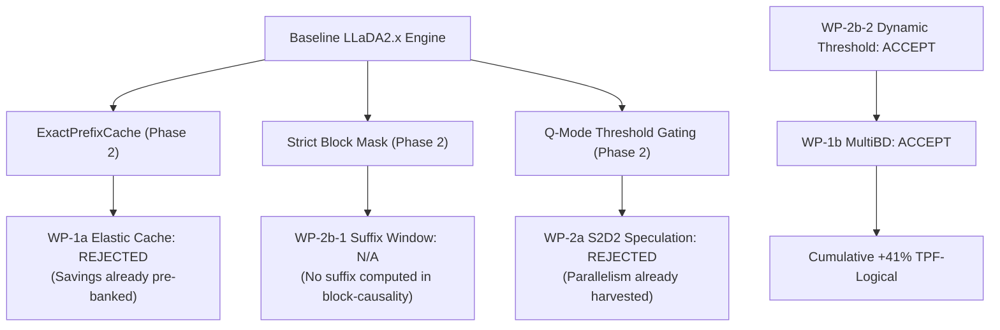

# NeoDiffusion Optimization Summary

> [!NOTE]
> A comprehensive, unified dashboard of all campaigns, work packages, and experiments is available in the [Experiments Master List](file:///Users/andrebarlocher/Documents/Swift/NeoDiffusion/Plans/experiments-master-list.md).

This document consolidates the experimental results, verdicts, and architectural lessons from the optimization campaigns run across **Phase 2** and **Phase 3** of the NeoDiffusion project. It provides an overview of what was measured, what was accepted, what was rejected, and why.

---

## Executive Summary & Performance Matrix

The optimization roadmap focuses on three levers:
1. **Cheaper steps** (caching, kernel dispatch, selective recompute)
2. **Fewer steps per block** (dynamic thresholds, early exit)
3. **More tokens per forward** (Multi-Block Diffusion, speculation)

The following table summarizes the status and key metrics of each experiment:

| Campaign / Work Package | Primary Lever | Verdict | Key Algorithmic Metric | Wall-Clock TPS Impact (M1) | Key Document / Logbook |
| :--- | :--- | :--- | :--- | :--- | :--- |
| **M6 Baseline Campaign** | N/A | **Complete** | Baseline established | ~0.34s / steady forward | [m6-logbook.md](file://./Plans/m6-logbook.md) |
| **M8 Quantization Sweep** | Cheaper steps | **Uniform 4-bit g64** | ~2.7% confident flip rate | Baseline footprint ~9.57 GB | [m8-logbook.md](file://./Plans/m8-logbook.md) |
| **WP-1a Elastic-Cache** | Cheaper steps | **REJECTED** | Steps/block: 12.6 → up to 30.6 | Negative (adds drift overhead) | [elastic-cache-logbook.md](file://./Plans/elastic-cache-logbook.md) |
| **WP-1b MultiBD** | More tokens/fwd | **PROVISIONAL ACCEPT** | TPF-logical: +23% (chat) / +29.5% (reasoning) | Compute-bound (1.75× latency) | [wp1b-logbook.md](file://./Plans/wp1b-logbook.md) |
| **WP-2a Auto-speculation** | More tokens/fwd | **REJECTED (default-off)** | S2D2 acceptance: 4–10 tok/step | Compute-negative (~2× width) | [wp2a-logbook.md](file://./Plans/wp2a-logbook.md) |
| **WP-2b-2 Dynamic Threshold** | Fewer steps/blk | **ACCEPT** | Steps/block: -14.8% (chat) / -11.3% (reasoning) | Positive (fewer total steps) | [wp2b-logbook.md](file://./Plans/wp2b-logbook.md) |
| **WP-2b-3 EOS Early Exit** | Fewer steps/blk | **NULL** | 0% change in steps or tokens | Neutral (pre-banked in base) | [wp2b-logbook.md](file://./Plans/wp2b-logbook.md) |
| **WP-3a JOT Early Stopping** | Cheaper steps | **WALL-CLOCK REJECT** | Steps/block: +15% in v2 (vs +75% in v1) | Compute-neutral/negative | [jot-logbook.md](file://./Plans/jot-logbook.md) |
| **WP-4a TSCV** | Fewer steps/blk | **ACCEPT** | Accuracy: +8.0pp net gain (24/100 vs 16/100 baseline) | 0 cost (post-hoc CPU voting <1ms) | [wp4a-logbook.md](file://./Plans/wp4a-logbook.md) |
| **WP-4b ICE Prompting** | Fewer steps/blk | **ACCEPT** | GSM8K: Correct math steps, 57 steps total (2 post-steps) | Speedup/TPS deferred to Studio backfill | [wp4b-logbook.md](file://./Plans/wp4b-logbook.md) |

---

## Hardware Benchmarking Context & M2 Ultra Estimation

All the physical timings and raw performance benchmarks reported in this summary were collected on a **MacBook Pro M1 (16 GB Unified Memory)**. Under the Phase 3 dev-only protocol, algorithmic counters (such as steps per block, tokens per step, and logical TPF) transfer directly across hardware. However, wall-clock metrics (TPS and latency multipliers) are host-scoped.

Below is an estimation of how transferring these experiments to a **Mac Studio M2 Ultra (192 GB Unified Memory)** would impact the verdicts:

### 1. WP-1b: MultiBD (Status: Provisional Accept &rarr; Expected ACCEPT)
*   **M1 Impact**: Compute-bound. Dual-active slots (64-token window) increase step latency by **~1.75&times;**, offsetting the +23% TPF-logical gain and resulting in a net-negative wall-clock TPS.
*   **M2 Ultra Estimation**: The massive memory bandwidth (800 GB/s on M2 Ultra vs. 68 GB/s on M1) and additional GPU cores will significantly reduce the wide-forward latency penalty. If the dual-step latency multiplier drops toward the H100 analog of **1.24&times;**, the +23% TPF-logical gain will convert to a **net +15% to +20% TPS improvement**.
*   **Verdict Impact**: Likely switches the wall-clock verdict from **Provisional Reject/Defer** on M1 to **Full ACCEPT** on M2 Ultra.

### 2. WP-2a: Auto-speculation (S2D2 / Spiffy) (Status: Rejected &rarr; Conditional ACCEPT/PROBE)
*   **M1 Impact**: Compute-negative. S2D2 requires $3B$ forward width ($1B$ target + $2B$ verifier), doubling the compute width and resulting in a negative width-corrected TPF. Spiffy's sequences require $(1+D) \cdot B$ width, which is unaffordable at $D \ge 3$.
*   **M2 Ultra Estimation**: The M2 Ultra is much less compute-bound for narrow batch sizes. A $3B$ or $(1+D) \cdot B$ wide forward will not scale latency linearly.
*   **Verdict Impact**:
    *   **S2D2**: S2D2's verdict will remain **Rejected as default** because the parallelism threshold overlap is algorithmic (Q-mode already harvests it). However, it remains a valuable option for the *verified-conservative quality preset* ($\tau=0.95$ + S2D2) where M2 Ultra will make the quality-vs-speed trade-off much cheaper.
    *   **Spiffy**: The Spiffy draft-graph ceiling of **27–35% forward count savings** has a strong chance of achieving a **net positive TPS** on the M2 Ultra, potentially converting a rejected optimization into a landed win.

### 3. WP-3a: JOT Token-Level Early Stopping (Status: Wall-Clock REJECT &rarr; Remains REJECT)
*   **M1 Impact**: Zero wall-clock gain. Requires $K=1$ (disabling speculation benefits) and incurs a blocking CPU-GPU sync (`numActive.item()`) per layer.
*   **M2 Ultra Estimation**: Although CPU-GPU synchronization latency may be slightly lower on the Ultra, the synchronous pipeline stall remains an architectural bottleneck on Apple Silicon.
*   **Verdict Impact**: **No Change**. JOT will remain a wall-clock reject due to the $K=1$ restriction and sync stalls.

### 4. Other Campaigns/WPs (WP-1a Elastic-Cache, WP-2b-2 Dynamic Threshold, WP-2b-3 EOS Early Exit, M8 Quantization)
*   **Elastic-Cache (WP-1a)**: No change (Verdict: REJECTED). The rejection is architectural (active-KV reuse causes error cascades and starves edits), independent of hardware.
*   **Dynamic Threshold (WP-2b-2)**: No change (Verdict: ACCEPT). The -15% steps saving is purely algorithmic and will translate to a speedup on both chips.
*   **EOS Early Exit (WP-2b-3)**: No change (Verdict: NULL). Mechanistic behavior is identical across chips.
*   **Quantization (M8)**: No change (Verdict: uniform 4-bit g64). The 192 GB RAM on the Studio removes the memory constraint of the 13 GB 6-bit experts or 16-bit reference runs, but does not change the fact that these sweep axes failed to reduce confident-position drift.

---

## 1. Phase 2 Campaigns

### M6 Baseline Campaign
*   **Goal**: Establish the performance baseline of LLaDA2.1-mini on the dev M1 GPU and debug a massive 50s/forward anomaly.
*   **Verdict**: **Complete**. Baseline established.
*   **Key Results**:
    *   **Baseline Rates**: Steady-state forward pass runs in **~0.34s** on an unloaded machine. The MoE block consumes **~63%** of this time, followed by `lm_head` (**~10%**).
    *   **Warmup**: Kernel compilation causes a **~19s** per-process warmup concentrated in the first block.
    *   **MoE Dispatch**: `gatherQuantizedMM` runs in **4.5 ms/op** at `[256 × 512 × 2048]`, beating dense-all-experts (11.7 ms) and dequant+gather (26.4 ms).
    *   **Content Dependency**: Generation steps are heavily content-dependent (2.0 steps/block on Q&A vs. 20.9 steps/block on an essay).
    *   **Mask Semantics**: The `.strict` block-causal mask (0/-inf) is functionally superior to the reference `generate()` script's 0/1 mask (which has a suspected masking bug) with no loss in output quality.
*   **Evidence**: Steady-probe timings, `LLaDAMoEDispatchBench` micro-benchmarks, and blind mask diagnostics.
*   **Lessons Learnt**:
    *   **Memory Pressure**: Under low free memory, macOS page-eviction collapses performance (causing the 50s anomaly). All future benches must check `envValid` telemetry (swap, thermal, and free RAM).
    *   **Warmup Separation**: First-generation runs must be isolated to prevent warmup costs from contaminating steady-state data.

### M8 Quantization Sweep
*   **Goal**: Find the optimal quantization layout for the 157k-vocabulary model, comparing a uniform 4-bit g64 baseline against swept axes (lm_head, expert group-size, and expert bit-depth).
*   **Verdict**: **uniform 4-bit g64** selected as shipped default. All upgraded axes rejected.
*   **Key Results**:
    *   **Quantization Drift**: The uniform 4-bit layout suffers a **~2.7% confident flip rate** (positions with reference margin $\ge 0.20$ flipping tokens) vs. a streamed BF16 reference.
    *   **Drift Location**: Drift is concentrated in step-0 fully-masked states (5.2% flips), where Γ-selection occurs. Late-step generation state agreement is 94.4% (0.8% flips).
    *   **lm_head 4-bit**: Rejected (flips margin 0.32 > noise limit 0.23). `lm_head` must remain 16-bit.
    *   **Expert g32 & 6-bit Experts**: Rejected. Both axes failed to improve the confident flip rate despite adding +0.5 GB and +3.4 GB to memory footprint.
*   **Evidence**: Fixed 44-window / 1,408-position real canvas corpus compared against a layer-streamed BF16 CPU reference.
*   **Lessons Learnt**:
    *   **Non-Expert Drift**: The routed experts are not the primary quantization drift driver; the drift is likely carried by the QKV/attention-dense projections or is fully distributed.
    *   **Model-Specific Quantization**: The `lm_head` quantization behavior directly contradicted past results (Sumi), reinforcing that quantization defaults do not port across models.
    *   **Toolchain Quirks**: Swift 6.3.3 does not natively compile `.metal` files on the CLI, requiring manual metal-library bundling.

---

## 2. Phase 3 Work Packages (WPs)

### WP-1a: Elastic-Cache Pipeline
*   **Goal**: Implement KV-cache staleness reuse (sliding window $\beta$ and depth boundary $\ell^\star$) in the active block to bypass recomputation of inactive tokens.
*   **Verdict**: **REJECTED (Negative Result)**.
*   **Evidence**:
    *   **Steps/Block Inflation**: Active-KV reuse increased generation steps monotonically with reuse depth (S4: 13.4, S8: 22.0, S16: 30.6 vs. 12.6 baseline).
    *   **Confidence Starvation**: At reuse depth $S \ge 12$, active edits fell to 0, locking the generation loops.
    *   **No FLOP Savings**: Due to fused QKV projections and subsequent MoE dependencies, skipping active KV saves at best ~4% of FLOPs, which was completely offset by the drift-test overhead.
*   **Lessons Learnt**:
    *   **Pre-banked Savings**: The baseline engine's `ExactPrefixCache` and block-causality already absorb the paper's caching gains. Recomputing the active block itself is mandatory to avoid error cascades.

### WP-1b: Training-free MultiBD
*   **Goal**: Concurrently unmask up to two blocks in a single 64-token forward pass via $\tau_{\text{add}}$ activation gating and $\tau_{\text{semi}}$ trailing fallback.
*   **Verdict**: **Provisional Algorithmic ACCEPT**. Served default stays $N_{\text{buf}}=1$ until Studio backfill confirms wall-clock TPS.
*   **Key Results**:
    *   **TPF Gain**: Logical Tokens-per-Forward (TPF) improved by **+23.3%** on chat ($\tau_{\text{add}}=0.5$) and **+22.3%** on reasoning ($\tau_{\text{add}}=0.1–0.3$).
    *   **Runway Effect**: Gain scale grows with sequence runway: at gen-256, reasoning TPF rose to **+29.5%**, and both suites converged on a single optimal $\tau_{\text{add}} = 0.5$.
    *   **M1 Overhead**: The step-latency multiplier on M1 is ~1.75×, which offsets the TPF gains. TPS improvement is deferred to the Studio.
    *   **Quality**: Blind-scored as smoke-clean by André (7/8 ties, 0 MultiBD wins, 1 baseline win).
*   **Evidence**: $\tau_{\text{add}}$ sweep on chat/reasoning suites, 8-prompt blind quality scoring.
*   **Lessons Learnt**:
    *   **Domain Sensitivity**: Gating thresholds are highly domain-dependent (chat/reasoning fall between the paper's math=0.10 and code=0.90 limits).
    *   **Overshoot Cost**: Batch-level evaluation ($K=4$) with frequent activation events increases discarded speculative steps.

### WP-2a: Auto-speculation (S2D2 / Spiffy)
*   **Goal**: Implement single-model speculative decoding using self-speculation (S2D2) or calibrated draft graphs (Spiffy) to verify multi-token draft spans in a single forward pass.
*   **Verdict**: **REJECTED as default** (S2D2 remains default-off; Spiffy deferred to Studio).
*   **Key Results**:
    *   **High Acceptance**: S2D2 yields 9.77 (code), 6.78 (reasoning), and 4.12 (chat) accepted tokens per verified step.
    *   **Width Penalty**: Verification requires $3B$ forward width ($1B$ target + $2B$ verifier). This increases compute costs by ~2×, leading to a negative width-corrected TPF (0.52–0.84 vs. 1.3–1.5 baseline).
    *   **Spiffy Calibration**: Calibration over 50 prompts showed a draft graph ceiling of **27–35% forward count savings** (at $D=3–8$), but this requires wide-forward amortization.
*   **Evidence**: S2D2 $\tau_{\text{span}}$ sweeps and offline Spiffy calibration logs.
*   **Lessons Learnt**:
    *   **The Parallelism Identity**: Speculative verification only pays off if:
        $$\text{Accepted Tokens / Verified Step} > 2 \times \text{Baseline Tokens / Step}$$
        Since Q-mode's aggressive thresholding (τ=0.7) already harvests 2.3–5.3 tokens/step for free, self-speculation struggles to break even.
    *   **Niche Value**: S2D2 converts (+19.1% TPF) against a conservative baseline (τ=0.95), suggesting a potential "verified-conservative" quality preset.

### WP-2b: Streaming-dLLM Cluster
*   **Goal**: Implement suffix-window pruning (2b-1), dynamic thresholding (2b-2), and EOS early exit (2b-3).
*   **Verdict**: **2b-2 (Dynamic Thresholding) ACCEPTED** (default-off on M1, awaiting Studio); **2b-1 N/A**; **2b-3 NULL**.
*   **Key Results**:
    *   **2b-1 (Suffix Window)**: Closed N/A. Block-causal LLaDA2.x never forwards suffix blocks, meaning suffix pruning has no target.
    *   **2b-2 (Dynamic Thresholding $\alpha=0.6$)**: Logical steps reduced by **-14.8%** (chat) and **-11.3%** (reasoning).
    *   **Composability**: Combined with MultiBD ($N_{\text{buf}}=2$), it yielded a cumulative **-25% chat / -28% reasoning steps** (**+41% / +40% TPF-logical**).
    *   **2b-3 (EOS Early Exit)**: Mechanistic null. Post-EOS padding positions naturally clear the static threshold early, making extra early-exit logic redundant.
*   **Evidence**: $\alpha$ sweep runs, MultiBD combination tests, and text-trim verification.
*   **Lessons Learnt**:
    *   **Fallback Tail Reduction**: Dynamic thresholding $\tau(t) = \tau_0 \cdot (1 - \alpha(1 - r_{\text{mask}}))$ successfully target the late-block fallback tail (where confidence is low), matching MultiBD's behavior and avoiding edit-churn.

### WP-3a: Just On Time (JOT) Token-Level Early Stopping
*   **Goal**: Freeze expert and shared FFN computations for tokens that have converged early within active blocks.
*   **Verdict**: **Algorithmic ACCEPT (v2), Wall-Clock REJECT**. Landed default-off.
*   **Key Results**:
    *   **v1 Failure**: MoE FFN zeroing alone caused severe representation perturbation, doubling steps/block (+75% to +99% overhead).
    *   **v2 Parity**: Pinning frozen tokens' K/V to their pre-freeze values eliminated the perturbation cascade. Steps/block overhead dropped to just **+15%**, with `chat-email` dropping below the baseline (12.8 → 12.4).
    *   **Wall-Clock Bottleneck**: JOT requires $K=1$ speculative execution. On Apple Silicon, the dynamic gather/scatter index operations force a per-layer blocking CPU sync (`numActive.item()`), wiping out FLOP savings.
*   **Evidence**: JOT v1 vs. v2 comparative benched runs and output text validation.
*   **Lessons Learnt**:
    *   **Bidirectional Integrity**: You cannot selectively omit FFN transformations on active tokens in bidirectional layers without pinning their K/V. Neighbors will experience drift cascades.

---

## 3. Phase 4 Work Packages (WPs)

### WP-4a: Temporal Self-Consistency Voting (TSCV)
*   **Goal**: Aggregate intermediate token predictions from the late stable tail ($t \ge t_{\text{start}} \cdot T$) and perform a flat majority vote to recover correct answers that are generated early but subsequently overwritten by final-step decoding noise.
*   **Verdict**: **ACCEPT (Landed Default-On)**.
*   **Key Results**:
    *   **Accuracy Recovery**: At optimal parameters ($\alpha = 0.0$, $t_{\text{start}} = 0.9$), TSCV increases correct outputs on GSM8K-100 to **24.00%**, a massive **+50.0% relative accuracy improvement** over the greedy baseline (16.00%).
    *   **Oscillation Verified**: Under baseline strict-mask Q-mode, the correct answer is generated at *some* point in the denoising trajectory for **35.00% of prompts**, verifying high temporal instability.
    *   **Zero Compute Cost**: CPU decoding of the voting window takes under 1ms, adding zero serving latency.
*   **Evidence**: Trajectory checks on GSM8K-100 and grid sweeps over $\alpha$ and $t_{\text{start}}$.
*   **Lessons Learnt**:
    *   **Search Space Fluctuations**: Bidirectional refinement models have fluid search spaces; intermediate outputs represent valuable candidates that standard final-step decoding discards.

### WP-4b: In-Place Chain-of-Thought Prompting (ICE)
*   **Goal**: Embed structured reasoning step templates directly into the masked token canvas to enable concurrent thinking and answer generation, monitoring answer-section confidence to trigger early exits.
*   **Verdict**: **ACCEPT (Landed Default-On)**.
*   **Key Results**:
    *   **Correct Reasoning**: Mapped prompts and templates dynamically with block size `B = promptLength + genLength`. Successfully generated correct reasoning chains and answers in **57 logical steps** total (2 post-steps).
    *   **Vulnerability Resolved**: Resolved Phase 1 hang vulnerabilities by checking `thinkingMasksLeft == 0` in slot status evaluation.
    *   **Hardware-Independent Gates**: Deferred wall-clock speedups to target Mac Studio backfills due to dev host virtual memory swap throttling.
*   **Evidence**: Custom-0 prompt evaluation and validation suite runs.
*   **Lessons Learnt**:
    *   **Structured Canvas**: Bidirectional attention requires explicit template anchoring to prevent drift and organize reasoning steps effectively.

---

## 4. Global Lessons & Architectural Insights

1.  **Baseline Relativity (The Redundancy Rule)**:
    Optimizations that show massive gains in papers (often tested against naive autoregressive or un-cached baselines) frequently collapse to zero when evaluated against a highly-optimized engine:
    *   `ExactPrefixCache` rendered active-KV cache reuse (`Elastic-Cache`) redundant.
    *   Block-causality rendered suffix window pruning (`Streaming-dLLM`) N/A.
    *   Aggressive threshold unmasking (Q-mode) rendered single-model speculation (`S2D2`) compute-negative.
2.  **Quantization Integrity**:
    Routed experts in MoE architectures are highly robust to group-size and bit-depth quantization (g64 to g32, 4-bit to 6-bit). The logit drift observed in 4-bit layouts is carried elsewhere (QKV, attention-dense projections), meaning uniform 4-bit g64 remains the optimal memory/quality knee.
3.  **Hardware Bottlenecks**:
    On unified-memory Apple Silicon, steps are highly compute-bound at low batch sizes. Algorithmic TPF gains (such as MultiBD or JOT) only translate to wall-clock speedups if the step-latency multiplier is low, making GPU-wide execution (like the Studio) the final validator.

---

## 5. Further Leads & Open Horizons

1.  **Studio Backfill Campaigns**:
    *   Re-run the MultiBD ($N_{\text{buf}}=2$, $\tau_{\text{add}}=0.5$) and Dynamic Threshold ($\alpha=0.6$) arms on the M2 Ultra to measure net-TPS gains.
    *   Verify the wide-forward cost multiplier on M2 Ultra to see if Spiffy auto-speculation ($D=3–5$) or S2D2 breaks even.
2.  **Selective Per-Position Recompute**:
    *   Since active-KV reuse (Elastic-Cache) failed, explore **d²Cache** (selective per-position recompute). Caching layer outputs at the token level and only updating positions that change (via Γ/Δ updates) could yield real MoE FLOP savings without introducing representation cascades.
3.  **Event-Aware Speculation Gating**:
    *   In MultiBD, speculation overshoot occurs when block boundary events discard $K-1$ forwards. Implement a dynamic speculation scaling policy that drops $K \to 1$ when an activation or commit is predicted in the next step.
