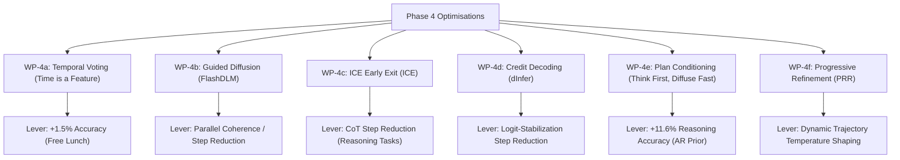

# NeoDiffusion Phase 4 — Further Optimisations Plan

**Status**: draft  
**Last updated**: 2026-07-12  
**Prerequisites**: Phase 2 and Phase 3 completed; baseline environment telemetry and MultiBD/Dynamic Thresholding stacks landed.  
**Objective**: This document defines the implementation plans, concrete experiments, and Apple Silicon evaluation methodologies for the training-free and lightweight training optimizations identified during the [Research Sources Evaluation](file://./Plans/research-sources-evaluation.md).

---

## Executive Summary of Phase 4 Levers

Phase 4 targets the remaining inefficiencies in dLLM decoding by focusing on **non-binary state representations, AR-coherence priors, early exit loops, temporal prediction voting, and dynamic trajectory control**.

---

## WP-4a: Temporal Self-Consistency Voting
*Sourced from [time-is-a-feature.md](file://./Resources/TimeIsAFeature/time-is-a-feature.md) and [temporal-self-consistency-voting.md](file://./Resources/TimeIsAFeature/temporal-self-consistency-voting.md)*

### 1. Concept & Mechanism
dLLMs suffer from *temporal oscillation*—intermediate steps frequently produce correct answers that are later overwritten with incorrect tokens by the final step. Temporal Self-Consistency Voting (TSCV) aggregates intermediate predictions from the second half of the denoising trajectory, clusters them by semantic equivalence, and performs an exponentially-weighted vote to select the final output.
$$\text{Output } a^* = \operatorname{argmax}_a \sum_{t=t_{\text{start}}}^T e^{\alpha(1 - t/T)} \cdot \mathbb{1}(\operatorname{meaning}(x_0^t) = a)$$

### 2. Concrete Experiments
*   **Experiment 1: Verification of Temporal Oscillation (Baseline Check)**
    *   **Goal**: Measure the "ever-pass" vs. "final-pass" accuracy gap in the Swift engine.
    *   **Method**: Run 100 math/reasoning prompts under strict-mask Q-mode. Log whether a correct answer was *ever* generated at any intermediate step vs. the final step.
    *   **Metric**: Ever-Pass@1 vs. Final Pass@1.
*   **Experiment 2: Decay Parameter ($\alpha$) Sweep**
    *   **Goal**: Optimize the step-weighting function to favor later steps while retaining early signals.
    *   **Method**: Implement voting with exponential decay. Sweep $\alpha \in \{1, 3, 5, 7, 9\}$ on the reasoning suite.
    *   **Metric**: Pass@1 accuracy, voting/clustering latency overhead (ms).
*   **Experiment 3: Cutoff Ratio ($t_{\text{start}}$) Sensitivity**
    *   **Goal**: Find the step threshold where intermediate outputs become reliable enough to vote.
    *   **Method**: Sweep $t_{\text{start}} \in \{0.3 T, 0.5 T, 0.7 T\}$.
    *   **Metric**: Pass@1 accuracy.

### 3. Apple Silicon Implications
*   **Compute Cost**: **Zero additional forward passes**. The algorithm reuses intermediate states already computed by the generator, introducing only minimal CPU overhead for string clustering.
*   **Memory Footprint**: Requires keeping a history of intermediate text outputs, which is negligible (few KB).

---

## WP-4b: Guided Diffusion
*Sourced from [flashdlm-tech-report.md](file://./Resources/FlashDLM/flashdlm-tech-report.md) and [guided-diffusion.md](file://./Resources/FlashDLM/guided-diffusion.md)*

### 1. Concept & Mechanism
Standard parallel unmasking breaks local dependencies because the DLM samples independently from conditional marginals, causing semantic incoherence (especially in code). Guided Diffusion uses a compact, pretrained AR model (e.g. Qwen2.5-1.5B) to guide unmasking. At each step, the DLM proposes tokens; the AR model processes the proposed sequence and only tokens where both models agree are accepted.

### 2. Concrete Experiments
*   **Experiment 1: AR Guider Integration & Baseline**
    *   **Goal**: Integrate a secondary AR model loader and implement the agreement check.
    *   **Method**: Load Qwen2.5-1.5B. DLM generates proposals for masked slots; AR runs a single causal pass on the sequence. Accept the contiguous prefix where $t_{\text{DLM}} == t_{\text{AR}}$ (sorted by DLM confidence).
    *   **Metric**: Accepted tokens per step, total steps/block, quality (coherence/compilation rate).
*   **Experiment 2: Guider Model Scale Ablation**
    *   **Goal**: Optimize the memory vs. speedup trade-off on unified memory.
    *   **Method**: Compare Qwen2.5-0.5B vs. Qwen2.5-1.5B vs. Qwen2.5-3B as guiders.
    *   **Metric**: End-to-end wall-clock TPS on M1 (16GB) and M2 Ultra (192GB).
*   **Experiment 3: Guidance Agreement Threshold ($\tau$) Sweep**
    *   **Goal**: Balance conservative single-token fallback with aggressive multi-token unmasking.
    *   **Method**: Implement stochastic agreement: accept if $P_{\text{DLM}}(v) > \tau \cdot P_{\text{AR}}(v)$. Sweep $\tau \in \{0.3, 0.5, 0.7\}$.
    *   **Metric**: Steps/block and Pass@1 accuracy.

### 3. Apple Silicon Implications
*   **Unified Memory**: Shared RAM allows both models to reside in memory without data transfer penalties.
*   **ANE Pipeline**: The lightweight AR guider can run on the Apple Neural Engine (ANE) concurrently with the DLM running on the GPU, effectively hiding its execution latency.

---

## WP-4c: In-Place Chain-of-Thought with Early Exit (ICE)
*Sourced from [ice-tech-report.md](file://./Resources/ICE/ice-tech-report.md) and [in-place-chain-of-thought.md](file://./Resources/ICE/in-place-chain-of-thought.md)*

### 1. Concept & Mechanism
ICE embeds structured reasoning step templates (e.g. "Step 1:", "Step 2:") directly into the active generation block. It refines the "thinking" section while monitoring the average confidence of the masked "answer" tokens. When the average answer confidence stabilizes above $\tau$, the engine exits the reasoning loop early and decodes the entire answer in a single parallel step.
$$\text{avg\_conf}_{\text{answer}} = \frac{1}{L_{\text{answer}}} \sum_{i \in \text{answer}} \max_v P(y_0, i = v \mid y^{(k)})$$

### 2. Concrete Experiments
*   **Experiment 1: ICE-SP vs. ICE-PP vs. Baseline**
    *   **Goal**: Quantify early-exit step savings vs. accuracy.
    *   **Method**: Implement early exit with Speed-Prioritized ($\tau = 0.8$) and Performance-Prioritized ($\tau = 0.9$) thresholds on GSM8K and MMLU paths.
    *   **Metric**: Total steps, average exit step, and accuracy.
*   **Experiment 2: Reasoning Step Template count ($N_t$) Sweep**
    *   **Goal**: Optimize the number of thinking step slots.
    *   **Method**: Sweep $N_t \in \{2, 3, 4, 5, 6\}$ templates.
    *   **Metric**: Steps/block, accuracy, and generation length anomalies.
*   **Experiment 3: Computational Mask Allocation**
    *   **Goal**: Determine the best unmasking schedule in the thinking phase.
    *   **Method**: Compare Uniform, Front-heavy (more tokens unmasked early), and Back-heavy (more tokens unmasked late) unmasking schedules.
    *   **Metric**: Answer confidence convergence rate.

### 3. Apple Silicon Implications
*   **Compute Reductions**: Since knowledge-intensive tasks (MMLU) exhibit rapid answer convergence, ICE can reduce steps/block by up to 10–50× on mobile/on-device reasoning tasks, cutting thermal throttling risks.

---

## WP-4d: Credit Decoding
*Sourced from [dinfer-framework.md](file://./Resources/dInfer/dinfer-framework.md) and [credit-decoding.md](file://./Resources/dInfer/credit-decoding.md)*

### 1. Concept & Mechanism
Credit Decoding tracks prediction stability across steps. Tokens that are consistently predicted accumulate credit. This credit is then used to boost their logits in subsequent steps, driving them over the unmasking threshold faster and reducing overall denoising steps.
$$C_{i,v}^t = \beta \cdot C_{i,v}^{t-1} + (P_\theta(v \mid x_t))^\gamma \quad \text{for } v = v^* \text{ (top candidate)}$$
$$\tilde{f}_\theta(x_t)_i^v = f_\theta(x_t)_i^v + \alpha \cdot \log(1 + C_{i,v}^t)$$

### 2. Concrete Experiments
*   **Experiment 1: Baseline vs. Credit Decoding**
    *   **Goal**: Verify step reduction via logit boosting.
    *   **Method**: Run credit decoding on chat and reasoning suites.
    *   **Metric**: Steps/block, TPF-logical, and quality.
*   **Experiment 2: Hyperparameter Sweeps ($\beta, \gamma, \alpha$)**
    *   **Goal**: Optimize credit accumulation and boost factors.
    *   **Method**: Grid search over decay factor $\beta \in \{0.8, 0.9, 0.95\}$, exponent $\gamma \in \{0.5, 1.0\}$, and boost scale $\alpha \in \{0.1, 0.5, 1.0\}$.
    *   **Metric**: Steps/block.
*   **Experiment 3: Memory Allocation Profile**
    *   **Goal**: Ensure credit tracking does not bottleneck memory bandwidth.
    *   **Method**: Profile RAM allocations and cache lines on the M1 under Credit Decoding.
    *   **Metric**: Peak memory footprint, memory read/write overhead.

### 3. Apple Silicon Implications
*   **Metal Implementation**: The credit accumulation matrix must be kept in unified memory and updated via a fused sampler kernel to prevent CPU-GPU synchronization bubbles.

---

## WP-4e: Autoregressive Plan Conditioning
*Sourced from [Think First, Diffuse Fast (arXiv:2603.13243)](file://./Resources/TimeIsAFeature/time-is-a-feature.md)*

### 1. Concept & Mechanism
Multi-step reasoning tasks pose a "coordination problem" for DLMs: they lack the incremental coherence-building properties of AR models. Plan Conditioning prepends a short (~100 token) natural-language plan generated by an AR model to the diffusion prompt. The plan serves as an immutable, globally visible "frozen scaffold." During denoising, all token positions attend to the plan, allowing structured global context to guide local generation from step 0.

### 2. Concrete Experiments
*   **Experiment 1: Baseline LLaDA2.1 vs. Plan-Conditioned Generation**
    *   **Goal**: Confirm reasoning/coding quality improvements.
    *   **Method**: Run reasoning/coding prompts with and without AR-generated plans.
    *   **Metric**: Pass@1 accuracy (GSM8K, HumanEval), steps/block.
*   **Experiment 2: Planner Model Scale & Quality Threshold Sweep**
    *   **Goal**: Verify the "quality threshold" on Apple Silicon by benchmarking small, high-capability models.
    *   **Method**: Compare plan generation using Qwen3.5/3.6/3.7 (1.5B vs. 3B vs. 7B) or fine-tuned Ornith models.
    *   **Metric**: Latent planning time (s), RAM usage (GB), and final DLM accuracy.
*   **Experiment 3: Prompt Engineering & Plan-Template Optimization**
    *   **Goal**: Tune the AR planner model's prompt to optimize plan structure.
    *   **Method**: Compare plans formatted as structured Markdown outlines (strategy-focused) vs. free-form prose.
    *   **Metric**: DLM steps/block and reasoning accuracy.

### 3. Apple Silicon Implications
*   **Planner Selection**: We must select highly performant small models (like Qwen3.5/3.6/3.7 or Ornith in the 1.5B/3B range) to clear the planner quality threshold while remaining within the 16 GB RAM boundary.

---

## WP-4f: Progressive Refinement Regulation (PRR)
*Sourced from [Progressive Refinement Regulation (arXiv:2603.04514)](file://./Resources/dInfer/iteration-smoothing.md)*

### 1. Concept & Mechanism
PRR regulates decoding speed by preventing redundant refinement of early-stabilized tokens. A token-wise Multi-Layer Perceptron (MLP) controller predicts "empirical convergence progress" based on intermediate hidden states. It then dynamically shapes the denoising distribution (via temperature scaling) to freeze converged tokens earlier and continue refinement only where needed.
Since different tasks (e.g. Coding vs. Chat) have vastly different convergence rates, we implement **Dynamic Prompt Routing** to select domain-specific MLP controllers.

### 2. Dynamic Controller Routing (Prompt Analysis)
To dynamically choose the correct controller at runtime without introducing latency:
1.  **AR-Planner Tagging**: If **Plan Conditioning (WP-4e)** is enabled, we instruct the AR planner model to prepend a classification tag to the plan (e.g., `[CODE]`, `[MATH]`, `[CHAT]`). At step 0, the Swift engine parses this tag to load the corresponding PRR-MLP weights.
2.  **Rule-Based Keyword Fallback**: If plan conditioning is disabled, a regex-based keyword parser matches common programming keywords (e.g. `def `, `func `, `import `) to route prompts.

### 3. Concrete Experiments
*   **Experiment 1: Trajectory Collection & MLP Controller Training**
    *   **Goal**: Collect rollouts and train the MLP controller on the dev M1.
    *   **Method**: Freeze the LLaDA-8B backbone. Generate decoding trajectories, extracting token-wise hidden states (dimension 4107). Train the MLP (10 epochs, AdamW) to predict convergence progress.
    *   **Metric**: Training loss, GPU memory footprint (GB).
*   **Experiment 2: Single vs. Routed Controllers Ablation**
    *   **Goal**: Evaluate the performance benefit of domain-specific controllers.
    *   **Method**: Compare a single generic controller against routed coding/chat controllers.
    *   **Metric**: Steps/block, logical steps, final text accuracy.
*   **Experiment 3: AR-Planner Tag Routing Reliability & Latency**
    *   **Goal**: Evaluate the accuracy and overhead of dynamic AR-planner tagging vs. regex matching.
    *   **Method**: Run a mix of 100 chat/math/code prompts. Measure how accurately the AR planner prepends classification tags (e.g., `[CODE]`, `[CHAT]`) vs. a regex keyword fallback, and log any parsing latency.
    *   **Metric**: Classification accuracy (%), parsing latency overhead (ms).

### 4. Apple Silicon Implications
*   **Feasibility on M1**: Because the massive 8B backbone remains frozen and gradients are only computed on the tiny MLP controller, training is highly feasible within the 16 GB limit.

---

## Non-Starter: Window-Diffusion (Pruning and Caching)

*   **Assessment**: **Redundant / Non-Starter**.
*   **Rationale**: Window-Diffusion (arXiv:2601.20332) uses a sliding window ($L=16$ or $L=32$) to prune and cache tokens, reducing the $O(L^2)$ attention cost of whole-canvas diffusion models (like base LLaDA or Dream).
*   **NeoDiffusion Context**: Our engine already utilizes block-wise decoding (size 32). In our pipeline, past blocks are permanently frozen and cached in `ExactPrefixCache`, while future blocks are causal-masked and never evaluated in-graph. Therefore, our active window is already physically constrained to the block level. Window-Diffusion would introduce sliding-window cache-eviction overhead on Apple Silicon for zero marginal FLOP savings.

---

## 5. Composability Matrix (Phase 4 Updates)

| | WP-4a: Temporal Voting | WP-4b: Guided Diffusion | WP-4c: ICE Early Exit | WP-4d: Credit Decoding | WP-4e: Plan Conditioning | WP-4f: PRR |
| :--- | :--- | :--- | :--- | :--- | :--- | :--- |
| **WP-4a: Temporal Voting** | — | Compiles cleanly | Highly compatible | Compiles cleanly | Compiles cleanly | Compiles cleanly |
| **WP-4b: Guided Diffusion** | | — | Interacts: AR guidance speeds up ICE convergence | Additive (Stabilizes proposals) | Highly Additive (Same AR model runs both plan and guidance) | Compiles cleanly |
| **WP-4c: ICE Early Exit** | | | — | Additive | Highly Additive (Plan provides CoT templates) | Additive |
| **WP-4d: Credit Decoding** | | | | — | Compiles cleanly | Additive |
| **WP-4e: Plan Conditioning** | | | | | — | **Provides Dynamic Routing Tags** |
| **WP-4f: PRR** | | | | | | — |
