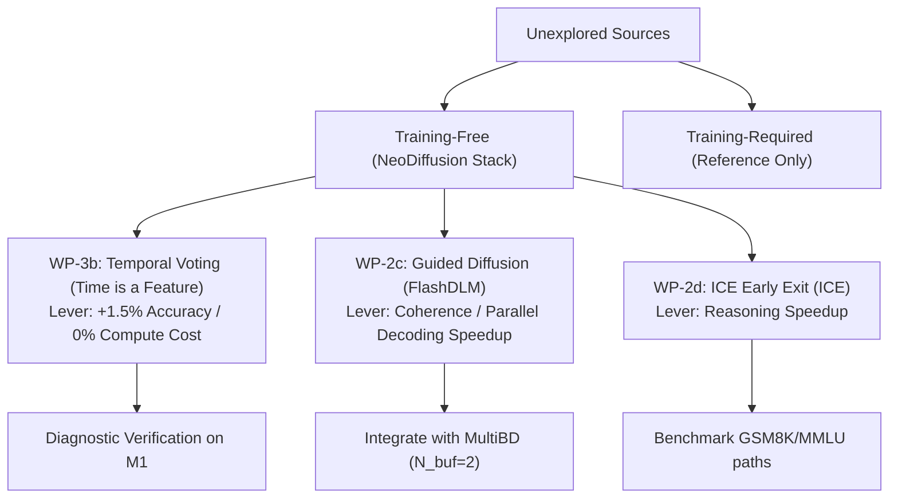

# Research Sources Evaluation: Unexplored Optimizations

This document evaluates the unexplored papers and technical reports from the [02-Sources](file:///Users/andrebarlocher/Documents/Obsidian/Diffusion/Diffusion/02-Sources) directory. These papers are analyzed for their applicability, performance potential, and implementation feasibility within the NeoDiffusion Swift/Metal engine.

---

## 1. Training-Free Optimizations (Immediate Feasibility)

These methods require no training or fine-tuning and can be integrated directly into the current [LLaDA2.1-mini](file:///Users/andrebarlocher/Documents/Swift/NeoDiffusion/Plans/phase-2-implementation-guide.md) engine.

### Guided Diffusion (from [FlashDLM](file:///Users/andrebarlocher/Documents/Obsidian/Diffusion/Diffusion/02-Sources/flashdlm-tech-report.md))
*   **Core Concept**: Combines the Diffusion LLM with a small, lightweight Autoregressive (AR) model (e.g., Qwen2.5-1.5B) to act as a causal "guider." At each step, the DLM proposes token candidates for all masked positions; the AR model processes these proposals causally and only accepts tokens where both models agree.
*   **Lever**: Fewer steps per block (enables much more aggressive parallel unmasking without semantic incoherence).
*   **Feasibility**: **High**. Requires loading a small AR model in memory alongside the DLM.
*   **Apple Silicon Implications**: Under unified memory, both models share the RAM pool. The lightweight AR model’s forward pass can run concurrently on the GPU or be offloaded to the Apple Neural Engine (ANE) to hide its execution latency.
*   **Composability**: Excellent. It acts as an unmasking filter inside the loop, composing directly with `ExactPrefixCache` and `MultiBD`.

### Temporal Self-Consistency Voting (from [Time is a Feature](file:///Users/andrebarlocher/Documents/Obsidian/Diffusion/Diffusion/02-Sources/time-is-a-feature.md))
*   **Core Concept**: Addresses *temporal oscillation* (where the correct token is generated at an intermediate step but overwritten by the final step). It stores intermediate decoded tokens across the second half of the denoising trajectory, clusters them by semantic meaning, and performs an exponentially-weighted vote to select the final output.
*   **Lever**: Accuracy/Quality improvement with **zero** additional inference-time forward passes.
*   **Feasibility**: **High**. Simply requires retaining intermediate token sequences in memory during generation.
*   **Apple Silicon Implications**: Adds negligible memory overhead (retaining a few text strings/tokens) and runs entirely on the CPU/GPU with no impact on memory bandwidth.
*   **Composability**: Compatible with all existing optimizations, though aggressive parallel decoding (which shortens trajectories) might slightly reduce the number of votes available.

### ICE: In-Place Chain-of-Thought with Early Exit (from [ICE](file:///Users/andrebarlocher/Documents/Obsidian/Diffusion/Diffusion/02-Sources/ice-tech-report.md))
*   **Core Concept**: Pre-fills the generation sequence with structured reasoning step templates (e.g., "Step 1: [MASK]") and leaves the answer section masked. During denoising, it monitors the average confidence of the (still-masked) answer tokens. Once the answer confidence stabilizes above a threshold $\tau$, it early-exits the reasoning loop and decodes the final answer in a single parallel step.
*   **Lever**: Fewer steps per block (bypasses polishing reasoning traces once the answer is settled).
*   **Feasibility**: **High**. Extends the current confidence-monitoring loops to track answer positions.
*   **Apple Silicon Implications**: Dramatically reduces the number of evaluated forward passes on reasoning tasks (up to 4× speedup on GSM8K, and up to 276× on MMLU), saving substantial energy and latency.
*   **Composability**: Highly compatible with `ExactPrefixCache` and threshold unmasking.

### Credit Decoding (from [dInfer](file:///Users/andrebarlocher/Documents/Obsidian/Diffusion/Diffusion/02-Sources/dinfer-framework.md))
*   **Core Concept**: Tracks predictions across denoising steps. Stable token predictions accumulate "credit" over time; candidates with high credit have their logits boosted in the current step to accelerate convergence.
*   **Lever**: Fewer steps per block.
*   **Feasibility**: **Medium**. Requires allocating a credit tracking buffer (size proportional to vocabulary size at active positions).
*   **Apple Silicon Implications**: Very low compute overhead, but requires careful optimization in Metal to avoid memory allocation thrashing.
*   **Composability**: Composes with threshold decoding by forcing stable tokens to cross the unmasking threshold earlier.

### Iteration Smoothing (from [dInfer](file:///Users/andrebarlocher/Documents/Obsidian/Diffusion/Diffusion/02-Sources/dinfer-framework.md))
*   **Core Concept**: Instead of replacing masked tokens with static `e_mask` embeddings, it blends the softmax probability distribution (logits) from the previous step into the mask embeddings:
    $$e_{t+1}[i] = e_{\text{mask}} + \alpha_t \cdot (p_t[i] \cdot W_{\text{emb}})$$
*   **Lever**: Fewer steps per block (accelerates convergence by retaining context from the previous step).
*   **Feasibility**: **Medium**. Requires a custom embedding kernel to compute the weighted sum of token embeddings.
*   **Apple Silicon Implications**: Modest memory bandwidth increase for embedding lookups.
*   **Composability**: Replaces standard mask embedding routing.

### CoDiLa: Locally Coherent parallel decoding (from [CoDiLa](file:///Users/andrebarlocher/Documents/Obsidian/Diffusion/Diffusion/02-Sources/locally-coherent-codila.md))
*   **Core Concept**: Diffusion model outputs soft marginal distributions per block, which are projected into a compact AR model's embedding space to decode a syntactically coherent block causally.
*   **Lever**: Quality preservation at aggressive block sizes.
*   **Feasibility**: **Medium-Low**. More complex than Guided Diffusion because it projects full distributions into the AR's embedding space, requiring custom projection math.

---

## 2. Training-Required Optimizations (Future Phases)

These methods require model retraining or SFT/DPO-style fine-tuning, making them unsuitable for the current frozen weights baseline.

### DMax: Soft Parallel Decoding & OPUT (from [DMax](file:///Users/andrebarlocher/Documents/Obsidian/Diffusion/Diffusion/02-Sources/dmax-tech-report.md))
*   **Core Concept**:
    1.  *On-Policy Uniform Training (OPUT)*: Fine-tunes the model on its own prediction errors, teaching it to denoise from both masks and noisy token embeddings.
    2.  *Soft Parallel Decoding (SPD)*: Inference is run entirely in the continuous embedding space by interpolating predictions with mask embeddings based on confidence:
        $$h_i^{t+1} = \alpha_i^t \cdot e_{\text{pred}, i}^t + (1 - \alpha_i^t) \cdot e_{\text{mask}}$$
*   **Lever**: More tokens per forward (enables massive parallel decoding up to 5.8 TPF by letting the model self-correct embedding drift).
*   **Feasibility**: **Low** (requires OPUT fine-tuning).
*   **Assessment**: A highly elegant mathematical alternative to hard discrete threshold decoding. If a DMax-aligned model is released or trained, it should be adopted immediately.

### CRoCoDiL: Continuous Guided MDM (from [CRoCoDiL](file:///Users/andrebarlocher/Documents/Obsidian/Diffusion/Diffusion/02-Sources/crocodil-tech-report.md))
*   **Core Concept**: Jointly trains a continuous latent prior (using a DiT on latent registers) and a guided discrete demasker. This continuous guidance reduces discrete MDM unmasking iterations by over 10×.
*   **Feasibility**: **Low** (requires full joint model training).

### Cola DLM: Continuous Latent Prior Transport (from [Cola DLM](file:///Users/andrebarlocher/Documents/Obsidian/Diffusion/Diffusion/02-Sources/cola-dlm.md))
*   **Core Concept**: Hierarchical latent diffusion using a Text VAE + block-causal DiT to transport global semantic priors.
*   **Feasibility**: **Low** (requires architectural retraining from scratch).

---

## 3. Recommended Research & Implementation Plan

### WP-3b: Temporal Self-Consistency Voting (Recommended Co-First)
*   **Why**: It is a rare "free lunch." Reusing the intermediate trajectories of the existing loops to vote on the final answer yields a +1.5% average accuracy gain with near-zero compute cost.
*   **Implementation steps**:
    1.  Add an intermediate trajectory buffer in `DiffusionEngine` to store text predictions at step $t$ for $t > T/2$.
    2.  Implement an exponential step-weighting function ($\alpha=5$).
    3.  Run a validation test to confirm accuracy gains on the chat/reasoning suites.

### WP-2c: Guided Diffusion (Feasibility Probe)
*   **Why**: Resolves the parallel decoding coherence bottleneck. It enables higher unmasking thresholds (higher TPF) while using a lightweight AR model (e.g., Qwen2.5-1.5B) to ensure syntax and local consistency.
*   **Implementation steps**:
    1.  Incorporate a secondary, lightweight AR model loader in the package.
    2.  Write an agreement kernel that performs a top-k causal match between DLM proposals and AR predictions.
    3.  Measure the net TPS delta (since it adds the AR model's forward latency but reduces total steps).

### WP-2d: ICE Early Exit
*   **Why**: Extremely powerful for reasoning-heavy tasks. It prevents the engine from wasting steps refining thinking steps once the answer tokens have stabilized.
*   **Implementation steps**:
    1.  Pre-structure the input blocks with reasoning step markers.
    2.  Track average confidence across the designated answer positions.
    3.  Exit the loop early once the threshold $\tau \ge 0.85$ is crossed and decode the answer in one final step.
